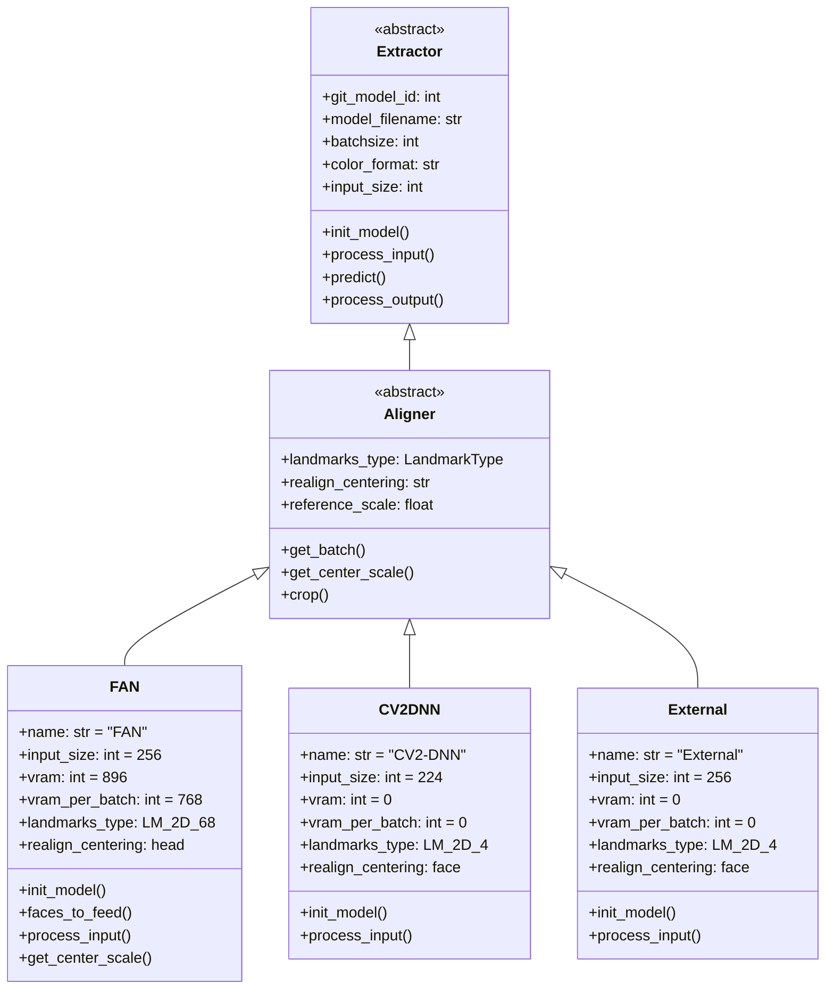
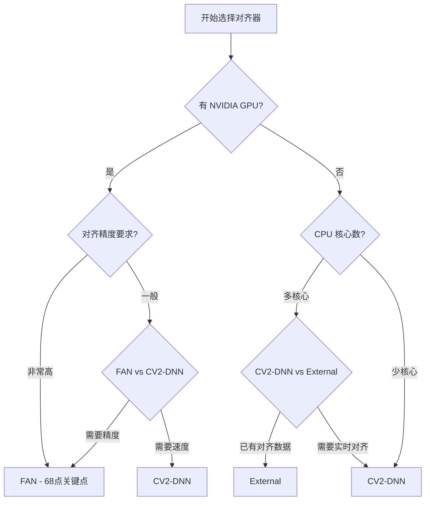

# Align（对齐器）产品文档

## 功能概述

人脸对齐（Face Alignment）是 Faceswap 人脸提取流程的第二个核心环节，其重要性不亚于人脸检测。人脸对齐的目标是将检测到的人脸区域经过几何变换，使其标准化到统一的位置、尺寸和姿态。这种标准化处理对于后续的人脸遮罩生成和模型训练都至关重要，因为只有输入数据格式一致，神经网络才能有效地学习人脸特征。

在 Faceswap 的工作流程中，对齐器接收检测器输出的人脸边界框和初步关键点，对人脸图像进行裁剪、缩放和旋转，使关键点对齐到标准位置。标准化的对齐人脸具有以下特点：双眼连线保持水平并位于图像中的固定位置，人脸尺寸统一为预设的分辨率（如 256×256 像素），人脸居中于图像中央。这些标准化的输入使得不同来源的人脸数据可以直接进行比较和融合。

人脸对齐的核心技术是人脸关键点检测（Facial Landmark Detection）。关键点是分布在人脸各部位的特定点，包括眼角、鼻尖、嘴角、脸廓边缘等位置。不同的对齐器使用不同数量和类型的关键点：有些使用 4 点关键点（双眼和嘴角），有些使用 68 点关键点（完整的脸部轮廓）。关键点数量越多，对齐的精度越高，但计算量也相应增加。

## 对齐器架构设计

### 基类设计与继承体系

Faceswap 的所有对齐器插件都继承自 `Aligner` 基类，该基类位于 `plugins/extract/align/_base.py` 文件中（虽然该文件不存在，但从代码结构推断应该存在）。`Aligner` 基类继承自通用的 `Extractor` 基类，遵循与检测器相同的插件架构设计模式。

对齐器插件体系的设计体现了Faceswap对扩展性的重视。每个对齐器只需实现核心的对齐逻辑，而批次管理、队列通信、错误处理等通用功能由基类提供。这种设计使得新增对齐算法时无需重复造轮子，只需专注于算法本身的实现。



### 关键点数据类型

Faceswap 定义了多种关键点类型（LandmarkType），用于标识不同对齐器使用的关键点格式：

**LM_2D_4（4点2D关键点）：** 最简化的关键点格式，包含左眼中心、右眼中心和两个嘴角共4个点。这种格式计算量小，适合快速处理场景，但对齐精度有限。

**LM_2D_68（68点2D关键点）：** 完整的2D关键点格式，包含脸部轮廓（17点）、眉毛（10点）、鼻子（9点）、眼睛（12点）和嘴巴（20点）共68个点。这种格式能够精确描述人脸形状，对齐精度高，是Faceswap的默认选择。

关键点类型的选择会影响后续处理流程。68点关键点能够提供更精确的对齐结果，而4点关键点则更适合资源受限的环境或对速度要求较高的场景。

### 批处理与数据流

对齐器的批次处理流程与检测器类似，但数据内容有所不同。对齐器的输入是检测器检测到的 `DetectedFace` 对象，每个对象包含人脸边界框和检测器提供的初步关键点。输出是经过对齐处理的 `AlignedFace` 对象，包含标准化的关键点坐标、变换矩阵和对齐后的人脸图像。

批次处理时，对齐器会将检测器输出的多个人脸组成批次，一起输入到关键点检测模型中。这种批处理方式能够充分利用 GPU 的并行计算能力。批次大小是一个关键参数，较大的批次可以提高 GPU 利用率，但也会占用更多显存。

在数据传递过程中，对齐器会维护一个滚动收集器，用于处理批次结束时未能填满的情况。与检测器不同，对齐器的滚动收集器处理的是单个人脸级别的数据，而不是帧级别的数据。这是因为对齐阶段需要将每张图像中的每个人脸作为独立的数据项进行处理。

### 变换矩阵计算

对齐过程中的核心计算是将原始人脸图像变换到标准位置的矩阵。这个变换是一个相似变换（Similarity Transformation），包括旋转、缩放和平移三种操作：

**旋转：** 将人脸旋转到标准方向，以双眼连线水平为基准。旋转角度由检测到的关键点计算得出，确保变换后双眼位于水平位置。

**缩放：** 将人脸缩放到统一尺寸。缩放比例基于关键点的分布范围，确保人脸在变换后占据图像的适当比例。

**平移：** 将人脸中心移动到标准位置。变换后人脸中心应位于图像的几何中心。

变换矩阵是一个 2×3 的仿射变换矩阵，可以用以下公式表示：

```
[cos(θ)  -sin(θ)  tx]     [s  0  0]   [cos(θ)  -sin(θ)  tx]
[sin(θ)   cos(θ)  ty]  =  [0  s  0] × [sin(θ)   cos(θ)  ty]
```

其中 θ 是旋转角度，s 是缩放因子，tx 和 ty 是平移量。这个矩阵被存储在 `AlignedFace` 对象中，后续的遮罩生成和图像裁剪都会用到它。

## 核心功能详解

### 人脸关键点检测

人脸关键点检测是对齐器最核心的功能。不同对齐器使用的算法和模型各不相同：

**FAN 对齐器** 使用 Face Alignment Network（FAN）模型进行 68 点关键点检测。FAN 是一个基于编码器-解码器结构的深度神经网络，将输入的人脸图像编码为高维特征，然后解码为关键点坐标。FAN 模型在 300W 数据集上训练，能够准确预测各种姿态和表情下的人脸关键点。

FAN 对齐器的处理流程如下：首先根据检测器提供的边界框裁剪出人脸区域；然后将裁剪后的图像缩放到模型输入尺寸（256×256）；接着将像素值归一化到 [0,1] 区间；最后将归一化后的图像输入模型进行推理，输出 68 个关键点的坐标。

FAN 模型预测的关键点是相对于归一化输入图像的坐标，需要通过逆变换映射回原始图像坐标系。这个逆变换使用的是与对齐过程相同的变换矩阵，因此关键点在变换后的人脸图像中具有标准的位置。

**CV2-DNN 对齐器** 使用 OpenCV 的深度神经网络模块进行 4 点关键点检测。该对齐器基于一个轻量级的 Caffe 模型，检测速度很快但精度相对较低。CV2-DNN 对齐器完全在 CPU 上运行，不需要 GPU 支持。

CV2-DNN 对齐器输出的 4 个关键点包括：左眼中心、右眼中心、左嘴角和右嘴角。这 4 个点足以进行基本的对齐操作，但对复杂姿态的人脸可能无法准确对齐。

### 人脸几何对齐

在获得关键点坐标后，对齐器执行几何变换将人脸对齐到标准位置。这个过程包括以下步骤：

**第一步：计算标准关键点位置。** 对齐器预设了一组标准关键点位置，这些位置定义了理想对齐状态下关键点应该在的位置。例如，标准状态下左眼和右眼应该在图像中对称的水平位置，脸部轮廓应该有合适的大小。

**第二步：计算变换参数。** 对齐器使用普鲁克分析（Procrustes Analysis）计算将当前关键点变换到标准位置的旋转、缩放和平移参数。普鲁克分析能够找到两组关键点之间的最优刚性变换。

**第三步：应用变换。** 使用计算得到的变换矩阵对人脸图像进行重采样，生成对齐后的人脸图像。重采样使用双线性插值（Bilinear Interpolation）来保持图像质量。

**第四步：存储变换信息。** 对齐器将变换矩阵、原始关键点和变换后的关键点保存到 `AlignedFace` 对象中，供后续处理使用。

### 对齐中心模式

Faceswap 提供了两种对齐中心模式（Centering Mode）：

**face（面部中心）：** 这是传统的对齐中心模式，以面部特征为中心进行对齐。在这种模式下，人脸在图像中居中显示，图像边界与面部轮廓之间保留适当的空间。这种模式适合大多数面部交换场景。

**head（头部中心）：** 这是扩展的对齐中心模式，以头部轮廓为中心进行对齐。在这种模式下，对齐后的人脸包含更多的颈部区域和头发区域，为后续的遮罩处理和融合处理提供更大的操作空间。FAN 对齐器默认使用 head 中心模式。

两种中心模式的切换会影响对齐图像的构图。在实际应用中，head 模式能够生成更大的有效遮罩区域，对于包含颈部或头发区域的遮罩算法尤其有益。但对于标准的遮罩算法，face 模式通常已经足够。

### 参考尺度计算

参考尺度（Reference Scale）是对齐器的一个重要参数，用于确定人脸在变换后图像中的大小。该参数定义了标准人脸大小的计算方式。

FAN 对齐器的默认参考尺度为 200/195，这个数值的计算基于训练数据集的平均人脸大小。参考尺度的选择会影响对齐后人脸在图像中的占比：较大的参考尺度会产生较大的对齐人脸，包含更多面部细节；较小的参考尺度则产生较小的对齐人脸，面部细节相对较少。

在处理特殊素材（如大头照或全身照）时，可能需要调整参考尺度以获得合适的对齐结果。

### 外部对齐器

External 对齐器是一种特殊类型的对齐器，它不执行实际的检测和对齐操作，而是从外部导入预先计算好的对齐结果。这种设计允许用户使用其他专业工具生成的对齐数据。

External 对齐器支持的输入格式包括：包含标准关键点坐标的 JSON 文件；Faceswap 专用格式的 `.fsa` 文件；以及其他工具导出的关键点数据。

使用 External 对齐器需要用户提供对齐后的人脸关键点数据，格式类似于以下结构：

```json
{
    "filename.jpg": {
        "landmarks": [[x1, y1], [x2, y2], ...],
        "transform_matrix": [[a, b, c], [d, e, f]]
    }
}
```

External 对齐器适用于以下场景：用户已经使用专业的人脸对齐工具处理过素材；需要将 Faceswap 与其他图像处理流程集成；调试和测试时需要固定的对齐结果。

## 插件详细说明

### FAN 对齐器

FAN（Face Alignment Network）是对齐器中精度最高的算法，使用深度神经网络进行 68 点关键点检测。该算法由论文《How far are we from solving the 2D \& 3D face alignment problem?》提出，是人脸对齐领域的经典算法之一。

**技术规格：**

- 模型输入尺寸：256×256 像素
- 输出关键点数量：68 个 2D 关键点
- 关键点类型：LM_2D_68
- 显存占用：约 896 MB
- 每批次显存增量：约 768 MB
- 对齐中心模式：head（可配置）
- 颜色格式：RGB

**适用场景：** FAN 对齐器适合对对齐精度要求较高的场景，特别是需要高质量遮罩或处理复杂姿态人脸的情况。在 GPU 上运行时，FAN 对齐器能够在保持高精度的同时实现较快的处理速度。

**模型文件：** FAN 对齐器需要下载预训练模型文件 `face-alignment-network_2d4_keras_v3.h5`。该模型文件存储在 Faceswap 的模型目录中，首次使用时如果本地没有该文件，系统会自动提示下载。

**配置参数：** FAN 对齐器的主要配置参数包括批次大小（batchsize）、参考尺度（reference_scale）和重新对齐中心（realign_centering）。批次大小影响处理速度和显存占用；参考尺度影响对齐后人脸的大小；重新对齐中心决定使用 face 还是 head 模式。

### CV2-DNN 对齐器

CV2-DNN 对齐器基于 OpenCV 的深度神经网络模块，使用轻量级的 Caffe 模型进行 4 点关键点检测。该对齐器完全在 CPU 上运行，不需要 GPU 支持。

**技术规格：**

- 模型输入尺寸：224×224 像素（或其他，由模型决定）
- 输出关键点数量：4 个 2D 关键点
- 关键点类型：LM_2D_4
- 显存占用：0（CPU 模式）
- 每批次显存增量：0（CPU 模式）
- 对齐中心模式：face

**适用场景：** CV2-DNN 对齐器适合以下场景：没有 NVIDIA GPU 的设备；需要最大化 CPU 利用率的批处理任务；对对齐精度要求不高的快速处理场景。

**性能特点：** 由于使用 CPU 计算，CV2-DNN 对齐器的处理速度相对较慢。但其优势在于不需要 GPU 显存，可以在任何支持 OpenCV 的系统上运行。

### External 对齐器

External 对齐器提供了一种灵活的集成方式，允许用户导入外部生成的对齐数据。该对齐器本身不执行任何计算，只是读取和验证输入数据。

**技术规格：**

- 模型输入尺寸：256×256 像素（可配置）
- 关键点类型：LM_2D_4 或 LM_2D_68（取决于输入数据）
- 显存占用：0
- 每批次显存增量：0

**适用场景：** External 对齐器适用于以下场景：用户已经使用专业工具生成了对齐数据；需要将 Faceswap 与其他图像处理流程集成；调试和测试时需要固定的对齐结果。

## 配置参数详解

### 通用对齐器参数

**aligner（对齐器选择）：** 指定使用的人脸对齐算法。可选值包括 `fan`、`cv2-dnn` 和 `external`。默认值根据运行模式自动设置：GPU 模式下默认为 `fan`，CPU 模式下默认为 `cv2-dnn`。选择对齐器时应综合考虑素材质量、硬件条件和精度要求。

**batchsize（批次大小）：** 指定每次处理时输入模型的人脸数量。较大的批次大小可以提高 GPU 利用率，但会占用更多显存。对于 8 GB 显存的显卡，建议批次大小为 16；对于 4 GB 显存的显卡，建议批次大小为 8 或更小。

### 尺寸过滤参数

**aligner_min_scale（最小人脸尺寸）：** 设置对齐人脸的最小尺寸阈值，以图像短边长度的比例表示。默认值为 0.03。这意味着如果对齐后人脸在原始图像中对应的区域小于短边的 3%，该人脸将被视为无效并被过滤掉。

**aligner_max_scale（最大人脸尺寸）：** 设置对齐人脸的最大尺寸阈值，以图像短边长度的比例表示。默认值为 4.00。这意味着如果对齐后人脸在原始图像中对应的区域大于短边的 400%，该人脸将被视为无效并被过滤掉。

### 归一化参数

**normalization（归一化方式）：** 设置图像归一化的方式。可选值包括：`none` 表示不进行归一化；`stretch` 表示进行对比度拉伸；`hist` 表示直方图均衡化；`clahe` 表示对比度受限的自适应直方图均衡化。不同的归一化方式会影响模型的学习效果。

**白化参数：** 对于某些模型，还可以配置是否对输入图像进行白化处理（减去均值、除以标准差）。白化处理能够消除图像间的光照差异，使模型更专注于学习人脸结构特征。

### 重对齐参数

**realign（重新对齐）：** 设置是否在初始对齐后进行重新对齐。重新对齐使用 68 点关键点（如果有）对初始对齐结果进行优化，能够提高对齐精度。默认值为启用。

**realign_eyes（眼部重新对齐）：** 设置是否专门对眼部区域进行重新对齐。眼部是面部最重要的特征之一，精确的眼部对齐对后续处理非常重要。

## 性能优化建议

### GPU 显存优化

**减小批次大小：** 如果遇到 GPU 显存不足的问题，首先尝试减小批次大小。每次减半批次大小，显存占用也会大致减半。

**使用 face 中心模式：** 相比 head 模式，face 模式生成的对齐图像尺寸较小，显存占用也相应较低。在不需要扩展遮罩区域的情况下，建议使用 face 模式。

**禁用不必要的功能：** 如果不需要 68 点关键点，可以考虑使用输出 4 点关键点的对齐器，减少模型复杂度。

### 处理速度优化

**选择合适的对齐器：** 在不需要最高精度的场景下，可以选择计算量较小的对齐器。CV2-DNN 是最快的对齐器（CPU），FAN 在 GPU 上有良好的速度-精度平衡。

**启用多进程模式：** 如果系统有多个 CPU 核心且不需要 GPU，可以启用多进程模式来加速 CPU 对齐器的处理。

**批量处理：** 将素材分批处理而不是逐个处理，可以减少 I/O 开销和模型加载次数，提高整体处理效率。

**使用 SSD 存储：** 将素材和对齐结果存储在 SSD 硬盘上可以显著减少数据读写时间。

## 常见问题与解决方案

### 对齐结果不准确

如果对齐后的人脸位置或姿态不正确，可能的原因和解决方案如下：

**检测器输出质量差：** 对齐器依赖检测器提供的初始关键点进行对齐。如果检测器输出的人脸边界框或关键点不准确，对齐结果也会受到影响。尝试更换或调整检测器。

**关键点类型不匹配：** 某些对齐器要求特定类型的关键点输入。确保检测器输出的关键点类型与对齐器期望的类型一致。

**人脸姿态极端：** 对于极端侧脸或大幅抬头低头的人脸，标准对齐方法可能无法正确处理。尝试使用更鲁棒的检测器或手动调整关键点。

### 处理速度过慢

如果对齐处理速度明显低于预期：

**检查 GPU 利用率：** 使用 `nvidia-smi` 检查 GPU 利用率。如果 GPU 利用率很低，可能是数据传输或 CPU 处理成为了瓶颈。

**批次大小设置不当：** 尝试增大或减小批次大小，找到适合当前硬件的最优设置。

**使用更快的对齐器：** 如果不需要最高精度，可以切换到 CV2-DNN 对齐器，其在 CPU 上运行且速度较快。

### 显存占用过高

如果对齐器占用过多显存：

**减小批次大小：** 批次大小直接影响显存占用。减小批次大小可以显著降低显存需求。

**禁用多进程：** 多进程模式会增加显存占用。在显存受限的环境中，禁用多进程可能有所帮助。

**关闭其他 GPU 应用：** 关闭浏览器、CUDA 计算程序等占用 GPU 的应用程序。

## 与其他模块的交互

### 与检测器的交互

对齐器接收检测器输出的 `DetectedFace` 对象作为输入。`DetectedFace` 对象中包含检测器检测到的人脸边界框和关键点坐标。对齐器使用这些信息初始化人脸对齐过程。

不同检测器提供的关键点数量和类型可能不同。S3FD 和 MTCNN 检测器输出 5 点关键点（双眼、鼻尖和两个嘴角），这些关键点足以进行基本对齐。如果使用 CV2-DNN 检测器配合输出 68 点关键点的对齐器，对齐器会使用自身的模型重新检测关键点。

### 与遮罩器的交互

对齐器的输出是 `AlignedFace` 对象，包含标准化的人脸图像和关键点。这些数据被传递给遮罩器用于生成人脸遮罩。对齐质量直接影响遮罩生成的质量：精确的对齐能够确保遮罩与人脸边缘完美贴合。

`AlignedFace` 对象中存储的变换矩阵是遮罩器进行反向变换的关键。遮罩器使用这个矩阵将生成的遮罩映射回原始图像坐标系，确保遮罩与原始图像中的人脸位置对齐。

### 与流水线的交互

对齐器作为流水线的第二个处理阶段，从检测器的输出队列接收数据，处理完成后将结果放入对齐阶段的输出队列，供遮罩器使用。

流水线的阶段切换机制确保每个阶段的数据正确传递。当检测器完成一帧的处理后，流水线会启动对齐器的处理。这种异步并行设计使得多个阶段的处理可以重叠进行，提高整体吞吐量。

## 技术原理深入解析

### 面部关键点检测原理

FAN（Face Alignment Network）基于编码器-解码器架构进行关键点检测。编码器部分使用 ResNet 或类似的主干网络提取图像特征，解码器部分使用转置卷积或上采样操作将特征图恢复到原始分辨率，输出每个关键点的热力图。

在训练阶段，模型学习从人脸图像到 68 个关键点热力图的映射。热力图的每个位置表示该位置为某个关键点的概率。通过最小化预测热力图与真实热力图之间的差异（通常使用均方误差或交叉熵损失），模型学习到准确的关键点定位能力。

在推理阶段，模型输出 68 个热力图，每个热力图对应一个关键点。通过在热力图上寻找最大值位置，可以得到该关键点的坐标。为了提高精度，通常使用亚像素定位技术（如高斯拟合）在热力图的峰值周围进行插值。

### 几何对齐变换原理

几何对齐的核心是寻找将原始关键点变换到标准位置的仿射变换矩阵。仿射变换是线性变换和平移的组合，可以用 2×3 的矩阵表示：

```
M = [a  b  c]
    [d  e  f]
```

变换的计算使用普鲁克分析（Procrustes Analysis）。首先计算两组关键点的质心；然后将两组关键点相对于质心进行归一化；接着计算归一化关键点之间的最佳旋转；最后将旋转应用到原始关键点并加上平移。

普鲁克距离（Procrustes Distance）用于衡量对齐误差，即变换后两组关键点之间的差异。较小的普鲁克距离表示更好的对齐效果。

### 图像重采样原理

将原始人脸图像变换到标准位置需要对图像进行重采样。重采样使用插值算法根据变换后的坐标计算新图像中每个像素的值。

Faceswap 使用双线性插值（Bilinear Interpolation）进行重采样。对于目标图像中的每个像素，计算其在原始图像中的对应位置，然后取该位置周围 2×2 区域内的四个像素值进行加权平均，得到目标像素的值。

双线性插值在计算效率和插值质量之间取得了较好的平衡。对于需要更高质量的场景，也可以使用双三次插值（Bicubic Interpolation）或 Lanczos 插值，但这些方法计算量更大。

## 最佳实践指南

### 对齐器选择建议

根据以下条件选择最合适的对齐器：



### 参数调优建议

**高质量特写镜头：** 使用 FAN 对齐器，批次大小 16，参考尺度使用默认值，对齐中心为 head。

**普通视频素材：** 使用 FAN 对齐器，批次大小 8，参考尺度使用默认值，对齐中心为 face。

**低质量/老照片：** 使用 CV2-DNN 对齐器，批次大小 4，对齐中心为 face。

**批量处理：** 使用 FAN 对齐器，批次大小 16 或更大，对齐中心为 face。

### 与遮罩器的配合

不同的对齐器配置会影响遮罩生成效果：

**使用 head 中心模式：** 生成的遮罩包含更多颈部区域，适合使用支持完整头部遮罩的遮罩器（如 BiSeNet）。

**使用 face 中心模式：** 生成的遮罩只包含面部区域，适合使用传统遮罩算法（如 VGG-Clear）。

**保持关键点数量一致：** 如果遮罩器需要 68 点关键点，确保对齐器也输出 68 点关键点。

### 质量检查建议

完成人脸对齐后，建议进行以下质量检查：

**关键点可视化：** 将对齐后的关键点叠加到对齐人脸上，检查关键点是否准确位于预期的面部位置。

**变换一致性检查：** 验证不同帧中同一人脸的对齐变换是否一致。不一致的对齐可能导致后续处理出现问题。

**边界检查：** 检查对齐后人脸是否完整地位于图像边界内，边界外的内容是否被正确裁剪。
