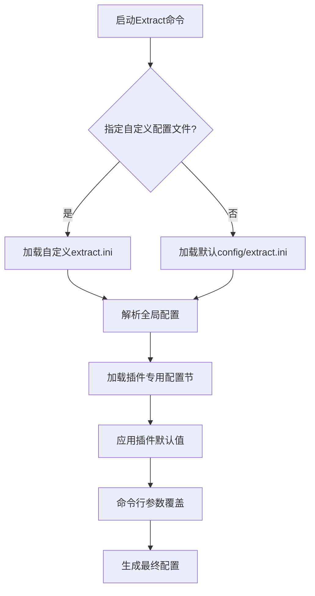
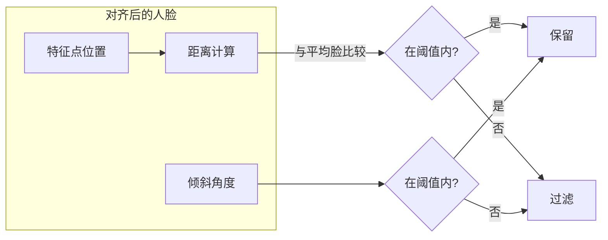
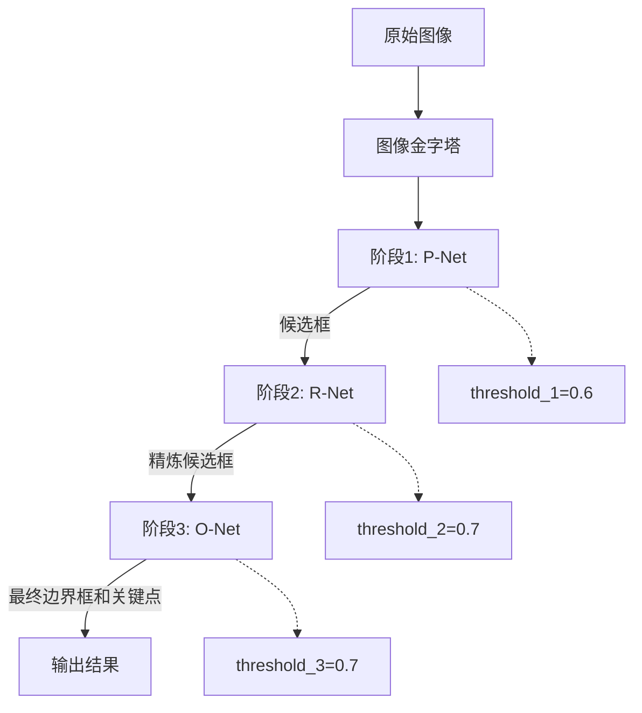
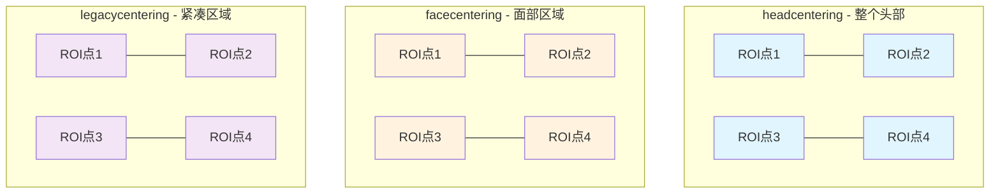
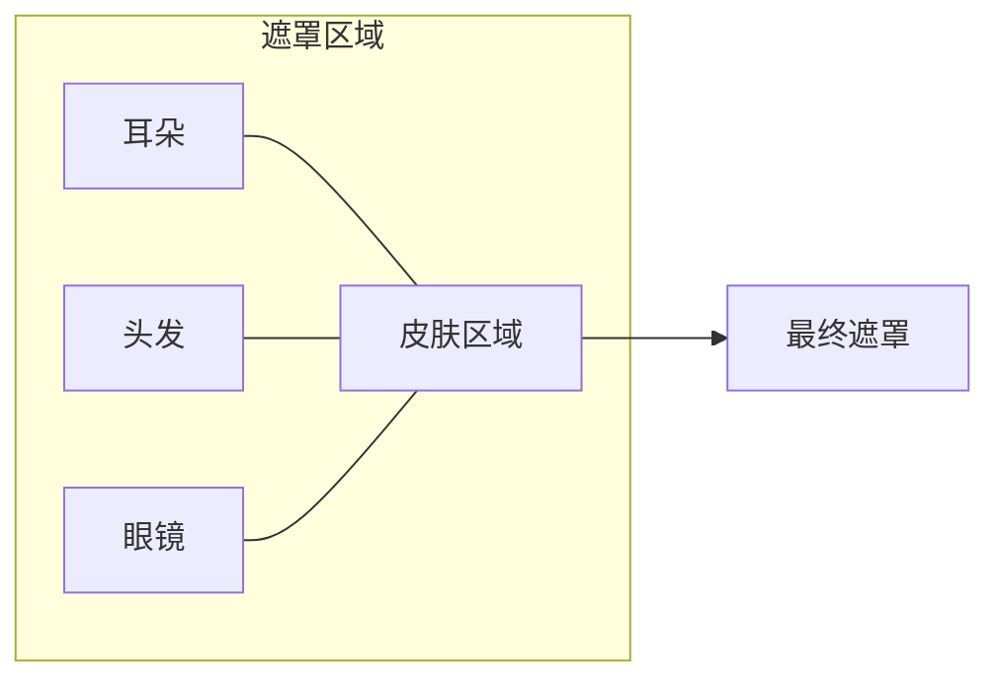
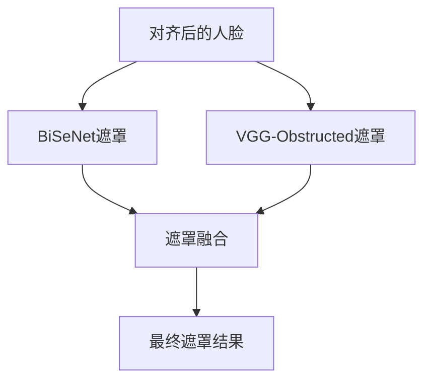
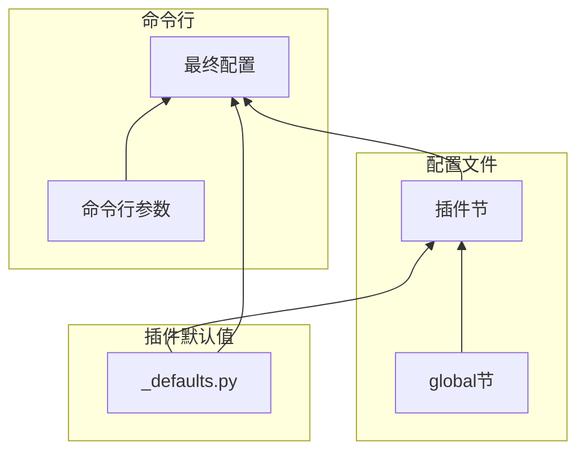

# Extract 配置(Config)产品文档

## 1. 概述

### 1.1 配置系统简介

FaceSwap的Extract功能采用分层配置架构，主要由以下组成部分：
- **全局配置**：`config/extract.ini`中的[global]节，定义适用于所有提取插件的通用设置
- **插件配置**：各子模块的独立配置节，如[detect.s3fd]、[align.fan]等
- **默认值定义**：通过`plugins/extract/*/_defaults.py`文件定义各插件的默认配置项

这种设计使得配置既能在单一文件中统一管理，又能保持各插件配置的独立性。

### 1.2 配置文件结构

配置文件的整体结构如下：

```ini
[global]
# 通用过滤和预处理设置

[align.external]
# External对齐器配置

[align.fan]
# FAN对齐器配置

[detect.cv2_dnn]
# CV2-DNN检测器配置

[detect.external]
# External检测器配置

[detect.mtcnn]
# MTCNN检测器配置

[detect.s3fd]
# S3FD检测器配置

[mask.bisenet_fp]
# BiSeNet遮罩器配置

[mask.custom]
# Custom遮罩器配置

[mask.unet_dfl]
# UNet-DFL遮罩器配置

[mask.vgg_clear]
# VGG-Clear遮罩器配置

[mask.vgg_obstructed]
# VGG-Obstructed遮罩器配置

[recognition.vgg_face2]
# VGG-Face2识别器配置
```

### 1.3 配置加载流程



## 2. 全局配置详解

### 2.1 人脸过滤设置

全局配置中包含人脸过滤的相关参数，用于在对齐阶段过滤掉不符合要求的人脸。

```ini
[global]
# 最小人脸尺寸过滤
# 帧最小维度的乘数，用于过滤掉过小的人脸
# 范围：0.0 - 1.0
# 默认：0.03
aligner_min_scale = 0.03

# 最大人脸尺寸过滤
# 帧最小维度的乘数，用于过滤掉过大的人脸
# 范围：0.0 - 10.0
# 默认：4.0
aligner_max_scale = 4.0

# 人脸特征点距离过滤
# 过滤掉与平均脸距离过大的人脸
# 范围：0.0 - 45.0
# 默认：40.0
aligner_distance = 40.0

# 人脸倾斜角度过滤
# 过滤掉倾斜角度过大的人脸
# 范围：0.0 - 90.0
# 默认：0.0（禁用）
aligner_roll = 0.0

# 人脸特征位置过滤
# 过滤掉眼睛/眉毛低于嘴巴的人脸（明显对齐错误）
# 默认：True（启用）
aligner_features = True
```

**过滤参数的作用机制**：



### 2.2 Re-feed过滤设置

当启用重送(Re-feed)功能时，可以对中间结果进行过滤：

```ini
# 对中间对齐结果进行过滤后再平均
# 默认：True
filter_refeed = True

# 保存被过滤的人脸图像到子文件夹
# 默认：False（直接删除）
save_filtered = False

# 对所有重送迭代进行重对齐
# 默认：True
realign_refeeds = True

# 过滤掉的对齐结果不进行重对齐
# 默认：True
filter_realign = True
```

### 2.3 全局参数速查表

| 参数名 | 类型 | 默认值 | 范围 | 说明 |
|--------|------|--------|------|------|
| aligner_min_scale | float | 0.03 | 0.0-1.0 | 最小人脸尺寸过滤 |
| aligner_max_scale | float | 4.0 | 0.0-10.0 | 最大人脸尺寸过滤 |
| aligner_distance | float | 40.0 | 0.0-45.0 | 特征点距离阈值 |
| aligner_roll | float | 0.0 | 0.0-90.0 | 倾斜角度阈值 |
| aligner_features | bool | True | True/False | 特征位置过滤 |
| filter_refeed | bool | True | True/False | 中间结果过滤 |
| save_filtered | bool | False | True/False | 保存过滤人脸 |
| realign_refeeds | bool | True | True/False | 重对齐所有迭代 |
| filter_realign | bool | True | True/False | 过滤结果不重对齐 |

## 3. 检测器配置

### 3.1 S3FD检测器

S3FD是一种高精度的人脸检测器，在GPU上表现优异。

```ini
[detect.s3fd]
# 检测置信度阈值
# 越高越严格，假阳性越少，但可能漏检
# 范围：25-100
# 默认：70
confidence = 70

# 批处理大小
# 越高性能越好，但显存消耗增加
# 范围：1-64
# 默认：4
batch_size = 4
```

**S3FD配置对检测效果的影响**：

```mermaid
xychart-beta
    title "confidence参数与检测效果的关系"
    x-axis [30, 40, 50, 60, 70, 80, 90]
    y-axis "比例" 0 --> 100
    bar [95, 90, 85, 80, 75, 65, 50]
    bar [80, 70, 60, 50, 40, 30, 15]
```



**显存消耗参考**：

| batch_size | 显存占用 | 推荐显卡 |
|------------|----------|----------|
| 1 | ~512MB | 入门级GPU |
| 4 | ~2GB | GTX 1060+ |
| 8 | ~4GB | RTX 2060+ |
| 16 | ~8GB | RTX 3060+ |
| 32 | ~16GB | RTX 3090+ |

### 3.2 MTCNN检测器

MTCNN是一种轻量级检测器，适合资源有限的环境。

```ini
[detect.mtcnn]
# 最小检测人脸尺寸（像素）
# 越小检测越多，但显存消耗大、假阳性多
# 范围：20-1000
# 默认：20
minsize = 20

# 图像金字塔缩放因子
# 越小检测越慢但可能更准确
# 范围：0.1-0.9
# 默认：0.709
scalefactor = 0.709

# 批处理大小
# 范围：1-64
# 默认：8
batch_size = 8

# 强制使用CPU
# True：节省显存，速度较慢
# 默认：True
cpu = True

# 三阶段阈值设置
# 阶段1：初步筛选
# 默认：0.6
threshold_1 = 0.6

# 阶段2：精细筛选
# 默认：0.7
threshold_2 = 0.7

# 阶段3：最终确认
# 默认：0.7
threshold_3 = 0.7
```

**MTCNN三阶段检测流程**：



### 3.3 CV2-DNN检测器

OpenCV的DNN模块实现的检测器，纯CPU运行。

```ini
[detect.cv2_dnn]
# 检测置信度
# 越高越严格
# 范围：25-100
# 默认：50
confidence = 50
```

### 3.4 External检测器

从外部JSON文件导入检测结果。

```ini
[detect.external]
# 导入文件名
# 默认：import.json
file_name = import.json

# 坐标原点位置
# top-left：左上角
# bottom-left：左下角
# top-right：右上角
# bottom-right：右下角
# 默认：top-left
origin = top-left
```

### 3.5 检测器配置对比

| 检测器 | 速度 | 准确度 | 资源消耗 | 适用场景 |
|--------|------|--------|----------|----------|
| S3FD | 快(GPU) | 高 | 高 | 最佳检测效果 |
| MTCNN | 快(GPU) | 中 | 中 | 平衡选择 |
| CV2-DNN | 中(CPU) | 低 | 低 | 无GPU环境 |
| External | N/A | 取决于源 | 低 | 外部数据导入 |

## 4. 对齐器配置

### 4.1 FAN对齐器

FAN(Face Alignment Network)是效果最好的对齐器。

```ini
[align.fan]
# 批处理大小
# 范围：1-64
# 默认：12
batch_size = 12
```

**FAN对齐器特点**：
- GPU上速度极快
- CPU上速度较慢
- 68点2D关键点输出
- 最佳对齐精度

### 4.2 External对齐器

从外部JSON文件导入对齐结果。

```ini
[align.external]
# 导入文件名
# 默认：import.json
file_name = import.json

# 坐标原点位置
# 默认：top-left
origin = top-left

# 4点ROI对齐方式
# head：整个头部
# face：面部区域
# legacy：传统紧凑区域
# none：仅用于导出后再导入
# 默认：head
four_point_centering = head
```

**four_point_centering示意图**：



### 4.3 对齐器配置速查表

| 参数名 | 适用插件 | 默认值 | 说明 |
|--------|----------|--------|------|
| batch_size | FAN | 12 | 批处理大小 |
| file_name | External | import.json | 导入文件名 |
| origin | External | top-left | 坐标原点 |
| four_point_centering | External | head | ROI对齐方式 |

## 5. 遮罩器配置

### 5.1 BiSeNet遮罩器

基于BiSeNet的人脸解析遮罩，支持细粒度的面部区域分割。

```ini
[mask.bisenet_fp]
# 批处理大小
# 范围：1-64
# 默认：8
batch_size = 8

# 强制使用CPU
# 默认：False
cpu = False

# 预训练权重选择
# faceswap：在Faceswap数据上训练的权重
# original：原始CelebAMask-HQ权重
# 默认：faceswap
weights = faceswap

# 包含耳朵
# 默认：False
include_ears = False

# 包含头发
# 默认：False
include_hair = False

# 包含眼镜
# faceswap权重：智能处理（见备注）
# original权重：完全包含或排除
# 默认：True
include_glasses = True
```

**BiSeNet遮罩区域示意**：



**weights参数差异说明**：
- **faceswap权重**：在多样化数据上训练，能处理眼镜、遮挡等情况
- **original权重**：仅在CelebAMask-HQ上训练，对真实场景适应性较差

### 5.2 Custom遮罩器

用于手动编辑的虚拟遮罩。

```ini
[mask.custom]
# 批处理大小
# 范围：1-64
# 默认：8
batch_size = 8

# 人脸居中方式
# face：面部居中
# head：头部居中
# 默认：face
centering = face

# 填充方式
# True：全部填充为1，需手动扣背景
# False：全部填充为0，需手动扣人脸
# 默认：False
fill = False
```

### 5.3 UNet-DFL遮罩器

社区开发的UNet遮罩器，适合正面人脸。

```ini
[mask.unet_dfl]
# 批处理大小
# 范围：1-64
# 默认：8
batch_size = 8
```

### 5.4 VGG-Clear遮罩器

适合清晰、无遮挡的正面人脸。

```ini
[mask.vgg_clear]
# 批处理大小
# 范围：1-64
# 默认：6
batch_size = 6
```

### 5.5 VGG-Obstructed遮罩器

适合有眼镜、手部遮挡的人脸。

```ini
[mask.vgg_obstructed]
# 批处理大小
# 范围：1-64
# 默认：2
batch_size = 2
```

### 5.6 遮罩器配置对比

| 遮罩器 | 遮挡处理 | 正面人脸 | 侧面人脸 | 显存消耗 |
|--------|----------|----------|----------|----------|
| BiSeNet-faceswap | 优秀 | 优秀 | 良好 | 中 |
| BiSeNet-original | 一般 | 优秀 | 一般 | 中 |
| Custom | 不适用 | 不适用 | 不适用 | 低 |
| UNet-DFL | 一般 | 优秀 | 差 | 中 |
| VGG-Clear | 差 | 优秀 | 差 | 中 |
| VGG-Obstructed | 良好 | 优秀 | 差 | 中 |

### 5.7 遮罩器组合使用

```ini
# 使用多个遮罩器
masker = ["bisenet_fp", "vgg_obstructed"]
```

多遮罩器的处理流程：



## 6. 识别器配置

### 6.1 VGG-Face2识别器

用于提取人脸特征向量，支持人脸身份识别。

```ini
[recognition.vgg_face2]
# 批处理大小
# 范围：1-64
# 默认：16
batch_size = 16

# 强制使用CPU
# 默认：False
cpu = False
```

**VGG-Face2特点**：
- 基于VGGFace2数据集训练
- 输出512维特征向量
- 可用于人脸聚类和身份匹配

## 7. 高级配置

### 7.1 命令行参数覆盖

配置文件中的参数可以被命令行参数覆盖：

```bash
# 使用命令行覆盖配置
python faceswap.py extract -i input/ -o output/ -D s3fd -A fan -M bisenet_fp \
    -s extract.ini  # 使用自定义配置
```

### 7.2 自定义配置文件

创建自定义配置文件的步骤：

1. **复制默认配置**：
   ```bash
   cp config/extract.ini config/my_extract.ini
   ```

2. **修改配置项**：
   ```ini
   [global]
   aligner_min_scale = 0.05  # 提高最小人脸尺寸
   aligner_distance = 35.0   # 降低距离阈值

   [detect.s3fd]
   confidence = 80  # 提高检测置信度
   batch_size = 8   # 调整批处理大小
   ```

3. **指定使用**：
   ```bash
   python faceswap.py extract -i input/ -o output/ -C config/my_extract.ini
   ```

### 7.3 配置继承关系



配置优先级（从低到高）：
1. 插件内置默认值
2. extract.ini配置文件
3. 命令行参数

## 8. 性能调优

### 8.1 显存优化

| 场景 | 优化建议 |
|------|----------|
| 显存不足8GB | 降低batch_size，启用cpu选项 |
| 多遮罩器组合 | 使用较轻量的遮罩器 |
| 检测+对齐+遮罩 | 考虑串行处理（multiprocess=False） |
| 大批量处理 | 保持适中batch_size，避免OOM |

### 8.2 速度优化

| 场景 | 优化建议 |
|------|----------|
| GPU利用率低 | 增加batch_size |
| CPU模式运行 | 启用多线程 |
| 检测速度慢 | 使用S3FD替代MTCNN |
| 遮罩速度慢 | 降低遮罩器质量要求 |

### 8.3 推荐配置组合

**高质量提取（RTX 3060+）**：
```ini
[global]
aligner_distance = 35.0
aligner_features = True

[detect.s3fd]
confidence = 70
batch_size = 8

[align.fan]
batch_size = 16

[mask.bisenet_fp]
batch_size = 8
weights = faceswap
```

**平衡配置（GTX 1660）**：
```ini
[global]
aligner_distance = 40.0

[detect.s3fd]
confidence = 75
batch_size = 4

[align.fan]
batch_size = 8

[mask.bisenet_fp]
batch_size = 4
cpu = True
```

**轻量配置（无GPU）**：
```ini
[global]
aligner_min_scale = 0.05

[detect.mtcnn]
cpu = True
batch_size = 4
minsize = 50

[mask.custom]
batch_size = 8
```

## 9. 常见问题

### Q1: 如何减少误检？

```ini
[detect.s3fd]
confidence = 85  # 提高检测阈值

[global]
aligner_distance = 30.0  # 严格过滤
aligner_min_scale = 0.05  # 过滤小人脸
```

### Q2: 如何检测小脸？

```ini
[detect.mtcnn]
minsize = 20  # 降低最小尺寸

[global]
aligner_min_scale = 0.02  # 降低最小人脸阈值
```

### Q3: 显存不足怎么办？

```ini
# 方案1：降低batch_size
[detect.s3fd]
batch_size = 1

# 方案2：使用CPU
[mask.bisenet_fp]
cpu = True

# 方案3：使用轻量检测器
# 改用MTCNN替代S3FD
```

### Q4: 遮罩质量差怎么办？

```ini
# 方案1：使用更好的遮罩器
[mask.bisenet_fp]
weights = faceswap
include_glasses = True

# 方案2：组合使用多个遮罩器
masker = ["bisenet_fp", "vgg_clear"]
```

### Q5: 如何调试配置问题？

启用详细日志：
```bash
python faceswap.py extract -i input/ -o output/ -D s3fd -A fan -L debug
```

日志中可查看：
- 配置加载情况
- 显存使用情况
- 检测/对齐/遮罩的详细参数

## 10. 配置文件模板

### 10.1 完整配置文件示例

```ini
[global]
aligner_min_scale = 0.03
aligner_max_scale = 4.0
aligner_distance = 40.0
aligner_roll = 0.0
aligner_features = True
filter_refeed = True
save_filtered = False
realign_refeeds = True
filter_realign = True

[align.fan]
batch_size = 12

[detect.s3fd]
confidence = 70
batch_size = 4

[mask.bisenet_fp]
batch_size = 8
cpu = False
weights = faceswap
include_ears = False
include_hair = False
include_glasses = True

[recognition.vgg_face2]
batch_size = 16
cpu = False
```

### 10.2 配置验证

使用Faceswap配置验证命令：
```bash
python faceswap.py extract -p validate  # 验证配置有效性
```
