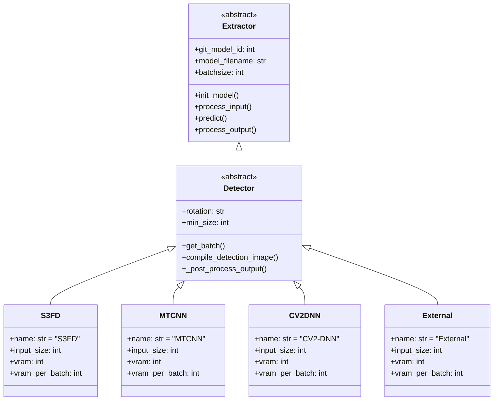
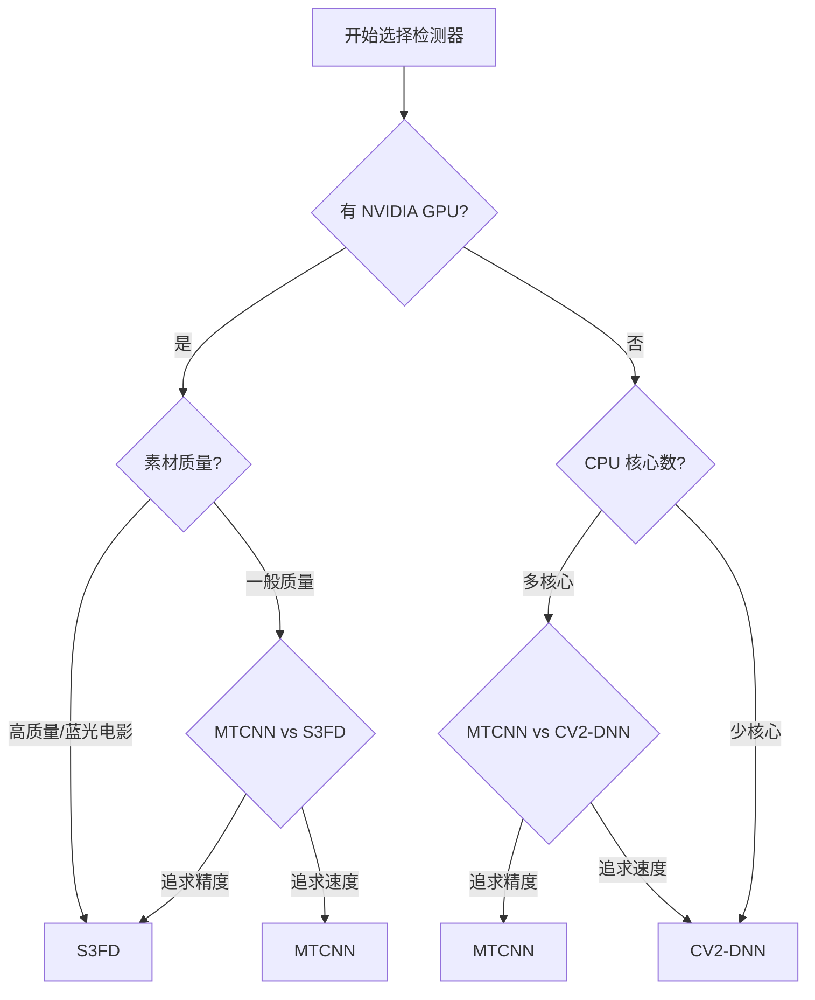

# Detect（检测器）产品文档

## 功能概述

人脸检测（Face Detection）是 Faceswap 人脸提取流程的第一个核心环节，承担着从原始图像或视频帧中定位人脸区域的关键任务。检测器的输出质量直接影响后续所有处理步骤的效果——如果检测器遗漏了人脸或误检了非人脸区域，后续的对齐和遮罩操作将无法修正这些错误。因此，选择和配置合适的检测器对于整个提取流程的成功至关重要。

Faceswap 的检测系统采用插件化架构设计，提供了多种检测算法供用户选择。这些检测算法在检测精度、运行速度、资源占用等方面各有优劣，适用于不同的使用场景和硬件条件。从算法原理上分类，现有检测器主要分为传统计算机视觉方法和深度学习方法两大类。传统方法如 CV2-DNN 基于级联分类器，运算速度快但精度相对较低；深度学习方法如 S3FD、MTCNN 则利用神经网络进行特征提取，能够实现更高的人脸检测准确率。

检测器的工作流程可以概括为以下几个阶段：首先接收原始图像输入，对图像进行必要的预处理（包括尺寸调整、归一化等），然后将处理后的图像输入到训练好的人脸检测模型中进行推理，模型输出人脸区域的边界框坐标和置信度分数，最后通过非极大值抑制（NMS）等后处理算法合并重叠的检测结果，得到最终的人脸位置列表。

## 检测器架构设计

### 基类设计与继承体系

Faceswap 的所有检测器插件都继承自 `Detector` 基类，该基类位于 `plugins/extract/detect/_base.py` 文件中。基类定义了检测器插件的标准接口和行为规范，确保不同检测算法之间的兼容性和可替换性。这种设计遵循了面向对象设计的开闭原则，使得新增检测算法时无需修改现有代码，只需按照规范实现相应的接口即可。

`Detector` 基类继承自更通用的 `Extractor` 基类，而 `Extractor` 基类又是整个提取模块插件体系的根类。这种多层继承的设计体现了代码复用的思想，`Extractor` 基类提供了所有提取器插件共有的功能，如批次管理、队列通信、错误处理等通用逻辑，`Detector` 基类则在 `Extractor` 的基础上添加了人脸检测特有的功能和方法。



### 批次处理机制

检测器采用批次处理模式来提高处理效率。每次处理时，检测器不是逐张图像单独处理，而是将多张图像组成一个批次（Batch）一起输入到模型中进行推理。批次处理能够充分利用 GPU 的并行计算能力，显著提升整体处理速度。批次大小（Batch Size）是一个关键的可配置参数，较大的批次可以更好地利用 GPU 资源，但也会占用更多显存。

批次处理的数据结构由 `DetectorBatch` 数据类定义，该类继承自 `ExtractorBatch` 基类。除了继承自基类的通用字段外，`DetectorBatch` 还包含检测器特有的字段，如原始图像数组、缩放比例、填充信息等。这些信息用于将检测器输出映射回原始图像坐标系，确保检测结果的准确性。

在批次处理过程中，检测器会维护一个滚动收集器（Rollover Collector），用于处理批次结束时未能填满批次的情况。例如，如果当前批次需要 16 张图像，但只剩下 14 张待处理图像，滚动收集器会将这 14 张图像组成一个不完整的批次进行处理，并将剩余的空间标记为已耗尽。这种设计确保了所有输入数据都能被正确处理，不会因为批次大小不匹配而丢失数据。

### 队列通信机制

检测器与流水线其他阶段之间通过线程安全的队列（Queue）进行数据传递。检测器从输入队列中获取待处理的图像数据，处理完成后将结果放入输出队列，供下游的对齐器使用。这种异步的数据传递方式使得各个处理阶段可以并行执行，大大提高了整体的处理效率。

每个检测器插件在初始化时会创建多个队列，包括输入队列、输出队列和内部状态队列。队列的名称遵循统一的命名规范，包含插件实例编号和阶段标识，便于在多实例场景下区分不同队列。例如，对于实例编号为 0 的检测器，其输入队列名称为 `extract0_detect_in`，输出队列名称为 `extract0_detect_out`。

队列的大小也是可以配置的。较大的队列能够缓存更多待处理数据，减少等待时间，但也会占用更多内存。在处理视频等流式数据时，队列大小的选择需要权衡内存占用和处理延迟两个因素。对于内存有限的系统，建议使用较小的队列大小；对于追求高吞吐量的场景，可以适当增大队列大小。

## 核心功能详解

### 人脸边界框检测

人脸边界框（Bounding Box）是检测器的主要输出，它以矩形坐标的形式表示检测到的人脸在原始图像中的位置和范围。边界框通常以 `[left, top, right, bottom]` 的格式表示，分别对应矩形左上角和右下角的坐标。这些坐标是相对于原始图像尺寸的绝对坐标，在后续处理中需要根据需要进行转换。

检测器输出的边界框附带置信度分数（Confidence Score），表示检测模型对这个人脸预测结果的确定性程度。置信度分数的范围通常在 0 到 1 之间，数值越高表示检测器越确信该区域确实包含人脸。用户可以通过配置参数设置置信度阈值，低于阈值的检测结果将被过滤掉，以减少误检（False Positive）的情况。

在实际应用中，检测器可能会对同一个人脸产生多个重叠的检测结果。这些重复检测是因为模型在图像的不同位置和尺度都检测到了人脸特征。为了消除冗余，检测器会应用非极大值抑制（Non-Maximum Suppression，NMS）算法，该算法会保留置信度最高的检测结果，同时移除与其高度重叠的其他检测结果。NMS 的重叠阈值是一个可配置参数，较小的阈值会导致更激进的去重，可能遗漏部分人脸；较大的阈值则可能保留过多的重复检测。

### 旋转处理功能

现实拍摄的人脸并非总是正对镜头，有时会存在一定角度的旋转。为了检测这些旋转的人脸，检测器提供了旋转处理（Rotation Handling）功能。该功能允许检测器在多个旋转角度下分别进行检测，从而捕获不同方向的人脸。

旋转处理支持多种配置模式。当设置为单一数值（如 `45`）时，检测器会以该数值为步长，在 0 到 360 度范围内进行检测。例如，步长为 45 度意味着检测器会在 0°、45°、90°、135°、180°、225°、270°、315° 这 8 个角度分别进行检测。当设置为 `on` 时，检测器会自动在 0°、90°、180°、270° 四个正交角度进行检测。也可以直接指定一个角度列表，如 `[-30, 0, 30]`，只在指定的角度进行检测。

旋转处理会显著增加计算量，因为需要在多个角度下分别运行检测模型。在实际使用中，应根据素材特点选择合适的旋转策略。对于大多数正面拍摄的视频素材，可以不使用旋转处理或只在 0° 检测；对于存在明显旋转的素材（如侧面照），则需要启用适当的旋转处理。如果素材中人脸旋转角度变化较大，可以考虑使用更大的角度步长或 `on` 选项。

### 最小人脸尺寸过滤

最小人脸尺寸过滤（Minimum Face Size Filter）是检测器的一个重要后处理功能，用于过滤掉尺寸过小的人脸检测结果。这些小尺寸检测通常是由图像噪声或复杂背景引起的假阳性（False Positive），对于后续处理没有实际价值，反而会增加计算负担。

最小人脸尺寸以相对比例的形式定义，而不是绝对像素值。具体来说，它表示人脸边界框对角线长度与图像短边长度的比值。例如，如果最小人脸尺寸设置为 0.05，而输入图像的短边为 720 像素，那么只有对角线长度大于 36 像素（720 × 0.05）的人脸才会被保留。这种相对比例的定义方式使得配置参数与图像分辨率无关，便于在不同分辨率的素材之间保持一致的行为。

在实际应用中，最小人脸尺寸的设置需要权衡检测召回率和误检率。设置过低会保留大量小尺寸检测，可能引入更多误检；设置过高则可能遗漏远处或微小的人脸。建议根据素材特点进行调整：对于高质量特写镜头，可以设置较低的阈值以保留更多细节；对于远景或全身照，则应设置较高的阈值以减少误检。

### 图像预处理

在将图像输入检测模型之前，检测器会进行一系列预处理操作，以确保模型能够正确理解和处理输入数据。这些预处理步骤包括图像尺寸归一化、像素值归一化、通道顺序调整等。

图像尺寸归一化是将输入图像缩放到模型要求的固定尺寸。不同的检测模型对输入尺寸有不同的要求：S3FD 模型通常需要 640×640 像素的输入；MTCNN 需要多尺度的图像金字塔；CV2-DNN 则使用原始尺寸或固定的缩放比例。检测器会自动根据所选模型的要求进行尺寸调整，并在处理完成后将结果映射回原始坐标系。

像素值归一化是将图像像素值从 `[0, 255]` 的整数范围转换到模型要求的浮点范围。对于使用 ReLU 激活函数的模型，通常将像素值归一化到 `[0, 1]` 区间；对于使用 tanh 激活函数的模型，则归一化到 `[-1, 1]` 区间。此外，一些模型还要求进行均值减法操作，即从每个像素值中减去训练数据集计算出的平均像素值，以消除光照差异的影响。

### 模型推理与后处理

检测器的核心是经过训练的人脸检测模型。模型接收预处理后的图像作为输入，输出人脸候选区域的预测结果。不同检测器使用的模型架构和推理方式各不相同：

**S3FD 检测器** 使用单阶段人脸检测器（Single Stage Face Detector）架构，该架构在单个前向传播过程中直接预测人脸边界框和置信度，具有较高的检测速度。模型输出包含多个特征层的预测结果，每个特征层负责检测不同尺度的人脸。检测器会将所有层的预测结果合并，并进行后处理得到最终的人脸位置。

**MTCNN 检测器** 使用多任务级联卷积网络（Multi-Task Cascaded Convolutional Networks），该方法通过级联的三个人脸检测网络逐步精化检测结果。第一个网络（P-Net）快速筛选可能包含人脸的区域，第二个网络（R-Net）进一步筛选和回归边界框，第三个网络（O-Net）输出最终的边界框和关键点坐标。这种级联结构能够在保持高精度的同时实现较高的检测速度。

**CV2-DNN 检测器** 基于 OpenCV 的深度神经网络模块，使用预训练的 Caffe 模型进行人脸检测。该检测器完全在 CPU 上运行，不需要 GPU 支持，因此运行速度相对较慢，但具有极低的资源占用和良好的兼容性。

模型推理完成后，检测器会进行一系列后处理操作，包括坐标转换、置信度过滤、非极大值抑制等。后处理的具体参数可以通过配置文件进行调整，以适应不同的使用需求。

## 插件详细说明

### S3FD 检测器

S3FD（Single Stage Face Detector）是一种高性能的人脸检测算法，在 Faceswap 的所有检测器中具有最高的检测精度。该检测器专为检测不同尺度的人脸而设计，通过精心设计的多尺度特征层能够同时检测大尺寸和小尺寸的人脸。

**适用场景：** S3FD 检测器最适合高质量素材的检测任务，如蓝光电影、专业摄影照片等。在这些场景下，S3FD 能够准确检测到各种角度和大小的的人脸，同时保持较低的误检率。由于其高精度特性，S3FD 也非常适合需要高召回率的场景，能够检测到其他检测器可能遗漏的人脸。

**硬件要求：** S3FD 检测器需要 NVIDIA GPU 支持，在 RTX 3000 系列显卡上能够实现最佳的检测性能。检测器默认使用约 896 MB 显存，每个批次额外占用约 768 MB 显存。对于显存较小的显卡，可以通过减小批次大小来适应。

**配置参数：** S3FD 检测器的核心配置参数包括批次大小（batchsize）和置信度阈值（threshold）。批次大小影响检测速度和显存占用，建议根据显卡显存容量进行调整。置信度阈值决定了检测结果的过滤严格程度，较高的阈值会减少误检但可能遗漏部分人脸。

### MTCNN 检测器

MTCNN（Multi-Task Cascaded Convolutional Networks）是一种广泛使用的人脸检测算法，以其良好的精度-速度平衡而著称。该算法通过级联的三级网络逐步精化检测结果，能够在保持较高检测精度的同时实现较快的检测速度。

**适用场景：** MTCNN 检测器适合中等质量的素材，特别是当硬件资源有限或没有高性能 GPU 时。在 CPU 上运行时，MTCNN 仍能提供可接受的检测速度；同时在 GPU 上运行时，MTCNN 能够发挥更好的性能。该检测器对遮挡和姿态变化有一定的鲁棒性，适合处理含有侧脸或部分遮挡的素材。

**硬件要求：** MTCNN 检测器既可以在 CPU 上运行，也可以在 GPU 上运行。在 CPU 上运行时，检测速度较慢但不需要 GPU 显存；在 GPU 上运行时，检测速度显著提升，但会占用约 1200 MB 显存。MTCNN 是 CPU 模式下 Faceswap 的默认检测器选择。

**配置参数：** MTCNN 检测器支持多尺度检测参数配置，包括图像金字塔的缩放比例范围和步长。较小的缩放比例步长能够检测到更小的人脸，但会增加计算量。用户可以根据素材特点调整这些参数，在检测精度和速度之间取得平衡。

### CV2-DNN 检测器

CV2-DNN 检测器基于 OpenCV 的深度神经网络模块，使用 OpenCV 自带的预训练 Caffe 模型进行人脸检测。这是一种完全基于 CPU 的检测方案，不需要任何 GPU 支持，因此具有极低的资源占用和良好的系统兼容性。

**适用场景：** CV2-DNN 检测器主要适用于以下场景：没有 NVIDIA GPU 的设备；需要最大化 CPU 利用率的批处理任务；对检测精度要求不高但需要快速处理的场景。由于其较低的检测精度，CV2-DNN 不适合高质量素材的精细提取任务，但在快速预览或低质量素材处理中仍有一定的实用价值。

**硬件要求：** CV2-DNN 检测器完全在 CPU 上运行，不占用 GPU 显存。其 CPU 占用率可以通过 OpenCV 的并行计算设置进行调整。由于不需要 GPU，该检测器是 Faceswap 在没有 GPU 环境下的默认选择。

**配置参数：** CV2-DNN 检测器的可配置参数相对较少，主要包括模型置信度阈值和后处理参数。置信度阈值控制检测结果的严格程度，建议根据素材质量进行调整。

### External 检测器

External 检测器是一种特殊的检测器，它本身不执行人脸检测，而是从外部 JSON 文件导入预先计算好的检测结果。这种设计允许用户使用其他专业的人脸检测工具或工作流程生成的检测数据，提供了极大的灵活性。

**适用场景：** External 检测器适用于以下场景：用户已经使用其他工具完成了人脸检测，希望直接使用现有结果；需要将 Faceswap 与其他图像处理流程集成；调试和测试时需要固定的人脸检测结果。

**输入格式：** External 检测器要求的 JSON 文件应包含每张图像的检测结果，格式类似于以下结构：

```json
{
    "image_filename.jpg": {
        "faces": [
            {
                "x": 100,
                "y": 50,
                "w": 200,
                "h": 250,
                "landmarks": [[x1, y1], [x2, y2], ...],
                "confidence": 0.95
            }
        ]
    }
}
```

## 配置参数详解

### 通用检测器参数

以下参数适用于所有类型的检测器：

**detector（检测器选择）：** 指定使用的人脸检测算法。可选值包括 `s3fd`、`mtcnn`、`cv2-dnn` 和 `external`。默认值根据运行模式自动设置：GPU 模式下默认为 `s3fd`，CPU 模式下默认为 `mtcnn`。选择检测器时应综合考虑素材质量、硬件条件和性能要求。

**batchsize（批次大小）：** 指定每次处理时输入模型的图像数量。较大的批次大小可以提高 GPU 利用率，但会占用更多显存。对于 8 GB 显存的显卡，建议批次大小为 16；对于 4 GB 显存的显卡，建议批次大小为 8 或更小。CPU 模式下的批次大小建议保持在 4 以下。

**filter_identified_faces（过滤已识别的人脸）：** 设置为 `True` 时，检测器会过滤掉已被识别为同一人的连续人脸，只保留每个连续片段中置信度最高的人脸。这在处理视频时可以减少同一人脸的重复检测，但可能遗漏快速移动或遮挡后重新出现的人脸。

### 旋转相关参数

**rotation（旋转角度）：** 设置检测器旋转处理的角度模式。可选值包括：`None` 或 `off` 表示不进行旋转检测，只在原始角度检测；`on` 表示在 0°、90°、180°、270° 四个正交角度检测；数值表示角度步长，如 `45` 表示每隔 45° 检测一次；列表表示指定的角度列表，如 `[-15, 0, 15]`。

旋转检测会显著增加计算量，实际处理时间约为不旋转时的 N 倍，其中 N 是检测角度的数量。在大多数情况下，建议先尝试不旋转的检测，如果发现大量侧脸未被检测到，再启用旋转处理。

### 尺寸过滤参数

**min_size（最小人脸尺寸）：** 设置检测人脸的最小尺寸阈值，以图像短边长度的比例表示。默认值为 0，表示保留所有检测到的人脸。有效取值范围为 0 到 1，建议值在 0.01 到 0.1 之间。

**max_size（最大人脸尺寸）：** 设置检测人脸的最大尺寸阈值，以图像短边长度的比例表示。默认值为 10，表示不限制最大尺寸。有效取值范围为 0 到 10。设置此参数可以过滤掉误检的超大人脸区域。

### 归一化相关参数

**normalize（归一化方式）：** 设置图像归一化的方式。可选值包括：`none` 表示不进行归一化；`stretch` 表示进行对比度拉伸；`hist` 表示直方图均衡化；`clahe` 表示对比度受限的自适应直方图均衡化。不同的归一化方式对不同类型的素材有不同的效果。

## 性能优化建议

### GPU 显存优化

当检测器遇到 GPU 显存不足的情况时，系统会自动减小批次大小以适应可用显存。用户也可以手动设置较小的批次大小来避免显存问题。如果经常遇到显存不足错误，可以尝试以下优化策略：

**启用单一进程模式：** 在命令行中使用 `-np` 或 `--singleprocess` 参数禁用多进程模式，这会降低处理速度但显著减少显存占用。

**减小批次大小：** 通过配置文件或命令行参数 `-b` 减小批次大小。每次减半批次大小，显存占用也会大致减半。

**关闭其他 GPU 应用：** 关闭浏览器、CUDA 计算程序等占用 GPU 的应用程序，释放更多显存给 Faceswap 使用。

### 处理速度优化

如果检测速度不理想，可以尝试以下优化策略：

**选择合适的检测器：** 在不需要最高检测精度的场景下，可以选择计算量较小的检测器。CV2-DNN 是最快的检测器（CPU），MTCNN 在 GPU 上有良好的速度-精度平衡，S3FD 虽然最准确但也最耗时。

**合理设置旋转检测：** 仅在必要时启用旋转检测，且尽量使用较大的角度步长。如果素材主要是正面人脸，可以完全禁用旋转检测。

**使用 SSD 存储：** 将素材存储在 SSD 硬盘上可以显著减少数据加载时间，特别是处理大量小文件时效果明显。

**关闭日志输出：** 在正式处理时使用 `-q` 或 `--quiet` 参数减少日志输出，避免 I/O 成为性能瓶颈。

## 常见问题与解决方案

### 检测不到人脸

如果检测器报告找不到任何人脸，可能的原因和解决方案如下：

**图像质量问题：** 确认输入图像的质量足够好，图像不应过度压缩或分辨率过低。可以尝试使用图像编辑软件增强对比度和清晰度。

**人脸尺寸过小：** 检查图像中的人脸尺寸是否小于配置的最小人脸尺寸阈值。减小 `min_size` 参数的值。

**人脸旋转角度过大：** 如果图像中的人脸旋转角度过大，尝试启用旋转检测功能。

**检测器选择不当：** 对于某些特殊类型的素材，可能需要尝试其他检测器。例如，MTCNN 对侧脸的检测效果可能优于 S3FD。

### 误检率过高

如果检测器输出了大量误检（非人脸区域被识别为人脸），可以尝试以下解决方案：

**提高置信度阈值：** 在配置文件中提高检测器的置信度阈值。较高的阈值会过滤掉置信度较低的检测结果。

**增加最小人脸尺寸：** 增大 `min_size` 参数的值可以过滤掉小尺寸的误检。

**使用更严格的检测器：** 如果当前使用的是 CV2-DNN，尝试切换到 MTCNN 或 S3FD，这些检测器的误检率更低。

### 检测结果不完整

如果检测器遗漏了部分人脸，可能的原因和解决方案如下：

**置信度阈值过低：** 尝试降低置信度阈值，但要注意平衡误检率。

**人脸被遮挡：** 部分遮挡的人脸检测难度较大，尝试使用对遮挡更鲁棒的检测器。

**多人脸场景：** 在密集人群场景中，小尺寸人脸可能被忽略。减小 `min_size` 参数并确保批次大小足够大。

### 处理速度过慢

如果检测处理速度明显低于预期：

**检查 GPU 利用率：** 使用 `nvidia-smi` 或任务管理器检查 GPU 利用率。如果 GPU 利用率很低，可能是数据传输或 CPU 处理成为了瓶颈。

**检查磁盘 I/O：** 如果素材存储在机械硬盘上，读取速度可能成为瓶颈。考虑将素材复制到 SSD 上处理。

**优化批次大小：** 尝试增大批次大小以提高 GPU 利用率，但要确保不超过显存限制。

## 与其他模块的交互

### 与对齐器的交互

检测器处理完成后，检测结果会被传递给对齐器进行人脸对齐。检测器输出的人脸边界框和关键点坐标是对齐器的输入数据。对齐器会使用检测器提供的关键点（如果有的话）来初始化人脸对齐过程。

不同检测器提供的关键点数量和格式可能不同。S3FD 和 MTCNN 会输出 5 个关键点坐标（双眼、鼻尖和两个嘴角），这些关键点足以进行基本的人脸对齐。如果检测器没有提供关键点，对齐器会使用额外的关键点检测器来生成关键点。

### 与流水线的交互

检测器作为流水线的第一个处理阶段，从流水线的输入队列接收待处理的图像数据。检测器完成处理后，会将检测结果放入检测阶段的输出队列，流水线管理器随后将结果传递给对齐器。

流水线的多阶段设计意味着检测器的处理时间会影响整体吞吐量。如果检测器成为瓶颈，可以考虑以下优化策略：使用更快的检测器、增加检测器实例数量（多进程模式）、优化检测器的批次大小设置。

## 技术原理深入解析

### 单阶段检测器原理

S3FD 属于单阶段（Single Stage）目标检测器，其核心思想是在网络的单个前向传播过程中同时预测目标的位置和类别。这种设计相对于两阶段检测器（如 Faster R-CNN）具有更高的推理速度。

S3FD 的网络架构包含多个特征提取层，每个层负责检测不同尺度的目标。对于人脸检测任务，网络在不同层的特征图上预测人脸边界框的坐标和置信度。低层特征图具有较高的空间分辨率，适合检测小尺寸人脸；高层特征图具有较大的感受野，适合检测大尺寸人脸。

为了提高小目标检测能力，S3FD 采用了特殊的特征金字塔结构，在不同尺度的特征图上进行预测。此外，S3FD 还使用了锚点框（Anchor Box）机制，在每个特征点位置预设多个不同尺度和长宽比的锚点框，预测相对于锚点框的偏移量来定位人脸。

### 级联检测器原理

MTCNN 采用级联（Cascade）结构，由三个逐渐复杂的网络组成：P-Net（Proposal Network）、R-Net（Refine Network）和 O-Net（Output Network）。

P-Net 是一个浅层网络，快速扫描图像金字塔，筛选出可能包含人脸的候选区域。由于网络较浅，P-Net 的计算速度很快，但精度有限。它会输出大量的候选框，其中大部分是背景区域。

R-Net 在 P-Net 输出的基础上进行进一步的筛选和边界框回归。这个网络比 P-Net 更深，能够更准确地判断候选区域是否包含人脸，并更精确地回归人脸边界框。

O-Net 是最后一个也是最精确的网络，它不仅输出最终的人脸边界框，还会预测人脸关键点的位置。O-Net 的输出是整个检测流程的最终结果。

级联结构的优势在于：早期的网络快速过滤掉大部分背景区域，减少后续网络的计算量；后期的网络专注于处理少量高置信度候选区域，能够投入更多计算资源提高精度。这种设计使得 MTCNN 能够在保持较高精度的同时实现较快的检测速度。

## 最佳实践指南

### 素材准备建议

在开始人脸提取之前，确保素材满足以下条件以获得最佳效果：

**图像质量：** 素材应具有足够的分辨率和清晰度。建议人脸区域的最小尺寸不低于 64 像素。对于低分辨率素材，可以在提取前使用超分辨率工具进行放大处理。

**图像格式：** 建议使用 PNG 或 JPEG 格式的图像。PNG 格式保留完整的图像质量，适合高质量素材；JPEG 格式文件较小，适合大批量处理但可能引入压缩伪影。

**文件组织：** 将待处理的素材放在单独的目录中，避免与其他文件混在一起。目录路径中不要包含中文字符或特殊符号，以免出现编码问题。

### 检测器选择决策树

根据以下条件选择最合适的检测器：



### 参数调优建议

**高质量特写镜头：** 使用 S3FD 检测器，批次大小 16，置信度阈值 0.85，禁用旋转检测，最小人脸尺寸 0.03。

**普通视频素材：** 使用 S3FD 或 MTCNN 检测器，批次大小 8，置信度阈值 0.85，启用旋转检测（45°步长），最小人脸尺寸 0.04。

**低质量/老照片：** 使用 MTCNN 检测器，批次大小 4，置信度阈值 0.7，启用旋转检测（on），最小人脸尺寸 0.02。

**大量素材批处理：** 使用 S3FD 检测器，批次大小 16 或更大，置信度阈值 0.9，禁用旋转检测，使用多进程模式。

### 质量检查建议

完成人脸提取后，建议进行以下质量检查：

**随机抽样检查：** 从提取结果中随机抽取一定比例的人脸图像，检查检测是否准确、对齐是否正确。

**统计信息检查：** 查看处理日志中的统计信息，包括检测到的人脸数量、每张图像的平均人脸数等。如果统计数据异常（如平均人脸数过高或过低），可能需要调整参数。

**错误日志检查：** 查看处理过程中产生的错误日志，确保所有图像都正确处理。如果有失败的图像，分析失败原因并考虑重新处理。
