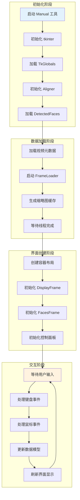
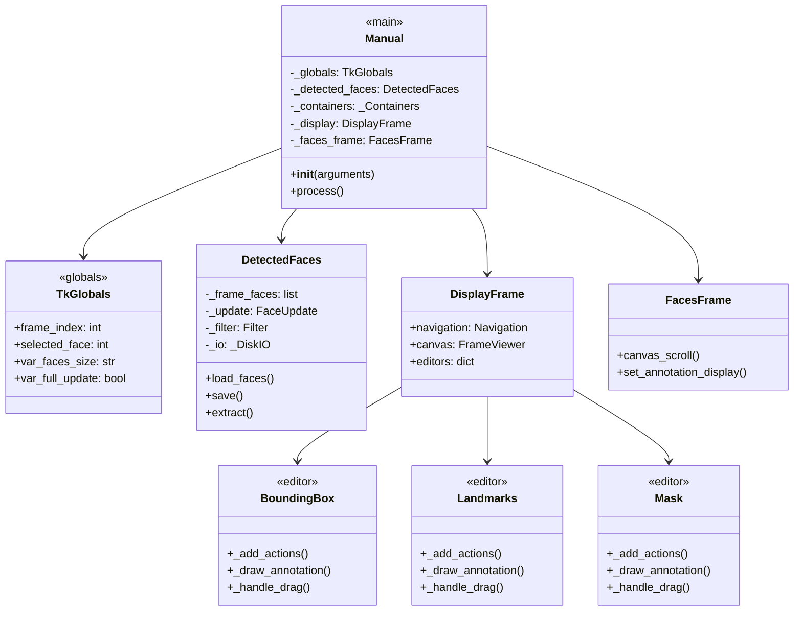
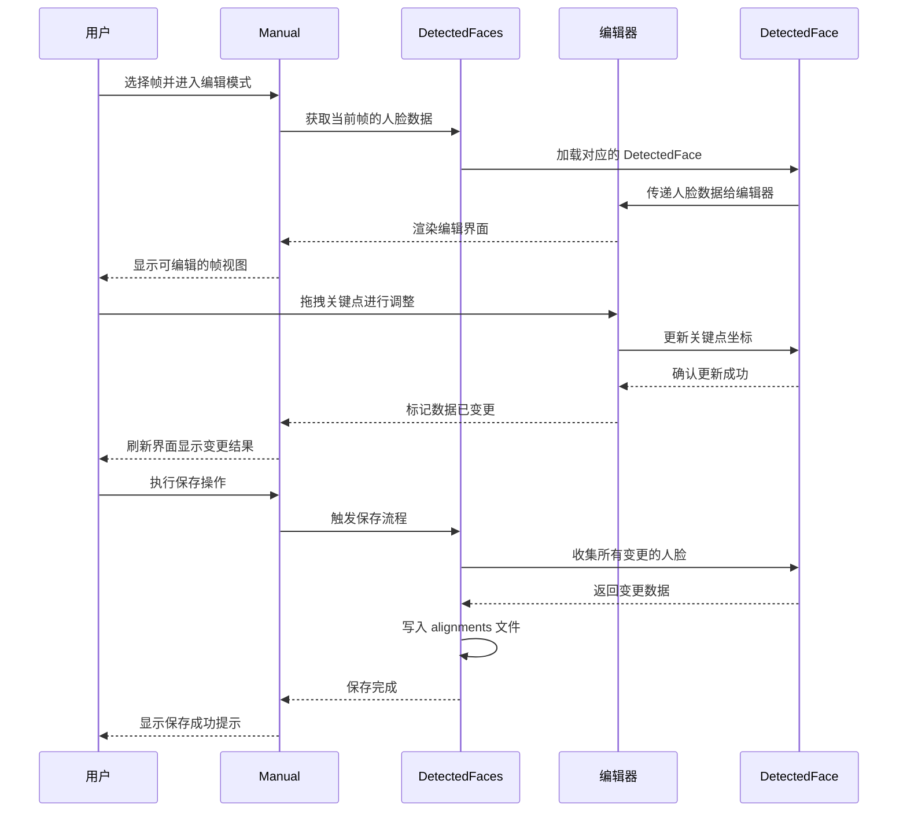

# Manual（手动校准工具）产品文档

## 功能概述

Manual 工具是 Faceswap 系统中专门用于手动校准和调整人脸检测结果的图形界面工具。该工具提供了可视化的人机交互界面，允许用户对人脸检测、对齐和遮罩的结果进行人工校正和调整。在自动化检测无法完美处理复杂场景（如遮挡、侧脸、低质量素材等）时，手动校准工具能够提供精确的人工干预能力，确保最终提取结果的质量符合预期标准。

与传统的人脸提取流水线不同，Manual 工具将人脸处理的中间结果完全暴露给用户，使用户能够直观地看到和修改每一个检测框、每一组关键点、每一个遮罩区域。这种透明化的设计理念使得用户能够精确定位问题所在，并通过直观的鼠标操作进行修正。工具支持多种编辑模式，包括边界框编辑、关键点调整、遮罩绘制、人脸复制等功能，覆盖了人脸校准过程中可能遇到的各种调整需求。

Manual 工具的设计目标并非完全替代自动检测流程，而是作为自动流程的补充和完善手段。在实际使用场景中，建议先使用自动提取流程处理整个素材，然后针对检测效果不理想的帧启动 Manual 工具进行局部修正。这种人机协作的工作模式既保证了处理效率，又确保了最终输出的质量。工具内置的缩略图缓存和批量处理机制也支持对大量帧进行连续编辑，显著提升了手动校准的工作效率。

## 架构设计

### 整体架构概述

Manual 工具采用了典型的 MVC（模型-视图-控制器）架构模式，将数据管理（模型）、界面展示（视图）和用户交互（控制器）分离设计。核心组件包括主窗口类 Manual、帧显示组件 DisplayFrame、人脸显示组件 FacesFrame、数据管理组件 DetectedFaces 以及多种编辑器组件。这种分层设计使得各组件职责明确，便于维护和扩展，同时确保了界面的响应性和数据的完整性。

工具的工作流程可以概括为以下几个主要阶段：首先初始化 tkinter 图形环境并加载全局配置参数；然后加载 alignments 文件和源帧数据，并启动后台线程进行预处理；接着创建主界面容器并等待后台线程初始化完成；初始化完成后显示帧查看器和面部查看器；最后进入主事件循环等待用户交互。每个阶段都设计了完善的错误处理和状态检查机制，确保工具在各种异常情况下都能给出清晰的错误提示。



### 核心类设计

Manual 工具的核心类体系继承了 Faceswap 插件化架构的设计理念，同时针对 GUI 应用的特点进行了适应性调整。主类 Manual 继承自 tk.Tk，作为整个应用的根窗口和事件调度的中枢。DetectedFaces 类负责 alignments 文件的读写和人脸数据的内存管理，其内部又包含 _DiskIO（磁盘操作）、FaceUpdate（数据更新）和 Filter（数据过滤）三个功能模块。

编辑器组件采用了策略模式设计，所有编辑器都继承自 Editor 基类并实现统一的接口规范。这种设计使得新增编辑器类型时只需实现标准接口，无需修改现有代码。主要编辑器包括 BoundingBox（边界框编辑）、ExtractBox（提取框编辑）、Landmarks（关键点编辑）、Mask（遮罩编辑）和 View（视图模式），每种编辑器针对不同的编辑对象提供专业的交互方式和视觉反馈。



### 数据流设计

工具内部的数据流向遵循单向流动原则，确保数据的一致性和可追溯性。原始帧数据从文件系统或视频文件加载后，首先进入 DetectedFaces 进行管理。当用户通过编辑器修改检测结果时，修改操作首先作用于内存中的 DetectedFace 对象，然后通过 FaceUpdate 模块记录变更历史，最后在用户执行保存操作时统一写回 alignments 文件。

帧查看器（DisplayFrame）和人脸查看器（FacesFrame）之间通过 TkGlobals 进行状态同步。当用户在帧查看器中选中某张脸时，人脸查看器会自动定位并高亮显示对应的缩略图；当用户在人脸查看器中点击某张脸时，帧查看器会自动跳转到该脸所在的帧并选中该脸。这种双向联动机制使得用户可以灵活地在帧级别和脸级别之间切换视角，快速定位需要编辑的目标。



### 线程协调机制

Manual 工具采用多线程架构来保证界面的响应性和数据处理的效率。Aligner（对齐器）和 FrameLoader（帧加载器）在后台线程中初始化和运行，避免了模型加载和帧读取操作阻塞主界面。工具使用事件队列（EventQueue）进行线程间通信，确保数据传递的线程安全性。

线程协调的核心逻辑在 _wait_for_threads 方法中实现。该方法循环检查 Aligner 和 FrameLoader 的初始化状态，直到两者都完成初始化后才继续执行后续操作。初始化完成后，Aligner 会被链接到 DetectedFaces，使其能够响应用户的关键点调整请求实时重新计算遮罩。如果输入视频没有有效的元数据，初始化过程还会自动提取并保存视频元数据到 alignments 文件中。

## 核心组件详解

### 主窗口组件

Manual 类是整个工具的入口点，负责协调各组件的初始化和生命周期管理。在 __init__ 方法中，工具首先验证输入参数的有效性，确保用户没有误将提取出的人脸文件夹作为输入（Manual 工具只接受源帧或视频文件作为输入）。验证通过后，工具进入图形界面初始化阶段，设置窗口标题、图标和初始几何参数。

主界面的布局采用 PanedWindow 控件实现上下分屏结构。屏幕上方约四分之三的区域用于显示帧视图（DisplayFrame），下方四分之一的区域用于显示人脸缩略图列表（FacesFrame）。这种布局设计使得用户能够同时看到帧级别的全景视图和人脸级别的细节视图，便于进行全局导航和局部编辑的切换。窗口支持全屏模式显示，可以最大化利用屏幕空间进行精细编辑。

窗口的初始化完成后会绑定一系列键盘事件处理函数，用于响应用户的快捷键操作。所有键盘快捷键都在 _handle_key_press 方法中统一处理，支持导航（Z/X/方向键）、播放（空格）、保存（Ctrl+S）、复制（V/C）等常用操作。快捷键系统采用修饰符识别机制，支持区分普通按键和组合键，避免不同操作之间的冲突。

### 帧显示组件

DisplayFrame 是帧查看器的核心容器组件，负责组织帧显示区域的所有界面元素。该组件包含运输控制栏（Transport Frame）、操作按钮栏（Actions Frame）和画布区域（Frame Viewer）三个子区域。运输控制栏提供帧导航、播放控制和距离阈值设置功能；操作按钮栏提供当前编辑器的模式切换按钮；画布区域是用户进行可视化编辑的主要工作区域。

FrameViewer 是实际负责图像渲染和交互处理的画布组件，继承自 tk.Canvas 并实现了自定义的绘制和事件处理逻辑。组件支持图像的缩放和平移操作，用户可以通过滚轮缩放视图、通过鼠标拖拽平移视图。在高分辨率素材编辑时，缩放功能特别有用，可以查看人脸区域的细节并进行精确的关键点调整。

DisplayFrame 的核心特性之一是多编辑器支持机制。通过 editors 属性，DisplayFrame 维护了当前可用的所有编辑器实例，并根据用户选择的操作模式动态切换当前编辑器。每个编辑器都实现了标准的控制接口和绘制接口，使得添加新编辑器类型变得简单直接。当前支持的编辑器包括 View（只读视图）、BoundingBox（边界框编辑）、ExtractBox（提取框编辑）、Landmarks（关键点编辑）、Mask（遮罩编辑）和 Mesh（网格视图）。

### 人脸查看组件

FacesFrame 组件负责显示当前帧中所有人脸的缩略图列表，提供了一种快速浏览和选择人脸的方式。缩略图以网格形式排列显示，每个缩略图下方显示该人脸在当前帧中的索引编号。用户可以通过点击缩略图选中对应的人脸，也可以通过键盘方向键在缩略图之间进行切换选择。

缩略图的显示尺寸可以通过界面右下角的 "Face Size" 下拉框进行调节，支持 Tiny、Small、Medium、Large、Extra Large 五种预设尺寸。较大的缩略图尺寸便于查看人脸细节，适合进行遮罩编辑等需要观察局部特征的操作；较小的缩略图尺寸则可以在一屏内显示更多人脸，适合快速浏览和对比选择。

FacesFrame 还支持与 DisplayFrame 的联动操作。当用户在帧视图中选择某张人脸时，对应的人脸缩略图会自动滚动到可见位置并高亮显示；反之，当用户在缩略图列表中选择某张人脸时，帧视图会自动跳转到该人脸所在的帧并选中该人脸。这种双向联动机制大大提升了多脸场景下的操作效率，用户无需手动搜索和定位目标人脸。

### 数据管理组件

DetectedFaces 是 Manual 工具的数据核心组件，负责管理整个会话期间加载的所有人脸数据。该组件封装了 alignments 文件的读写操作、人脸数据的内存存储、变更历史记录和数据过滤查询等功能。对于一个包含 N 帧的视频序列，DetectedFaces 内部维护着一个大小为 N 的列表，每个元素是对应帧的人脸列表，每个元素本身又是一个 DetectedFace 对象列表。

DiskIO 子组件负责 alignments 文件的持久化读写。在加载阶段，DiskIO 从 alignments 文件中读取已有的检测数据，如果文件不存在则创建新的空文件。在保存阶段，DiskIO 将内存中的所有变更合并后写回文件，支持增量保存和完整保存两种模式。工具会自动跟踪数据变更状态，在用户尝试关闭窗口时如果检测到未保存的变更，会提示用户进行保存。

FaceUpdate 子组件封装了对人脸数据的各类更新操作，包括添加新人脸、删除已有脸、复制脸到相邻帧、恢复保存前状态等。每种操作都对应一个独立的方法，支持通过快捷键或菜单触发。操作执行后会立即更新内存中的人脸数据，并触发界面刷新以反映变更结果。部分操作（如删除）还会记录到操作历史中，支持后续的撤销和重做功能。

### 对齐器组件

Aligner 组件是 Manual 工具内部的一个人脸处理流水线，用于在用户调整关键点后重新计算人脸对齐和遮罩结果。该组件封装了 Faceswap 的对齐器和遮罩器模型，支持 FAN（Face Alignment Network）、CV2-DNN 和 Mask 三种模型类型。当用户在编辑器中调整关键点位置后，工具会调用 Aligner 的接口将新的关键点输入模型，模型输出更新后的对齐人脸和遮罩数据。

Aligner 的设计采用了延迟计算策略，仅在实际需要时（如遮罩编辑器需要显示遮罩预览）才执行模型推理。这种策略避免了不必要的计算开销，特别是在用户连续快速调整关键点时，只会对最终位置执行一次计算。组件内部维护着模型缓存，相同输入不会重复计算，进一步提升了响应速度。

Aligner 与 DetectedFaces 之间通过事件机制进行通信。当 DetectedFaces 中的人脸数据发生变更（如用户手动调整了关键点）时，会通知 Aligner 重新计算受影响的遮罩区域。计算完成后，结果会自动更新到对应的人脸对象中，并在界面上反映出来。这种响应式的更新机制确保了用户的每次编辑操作都能立即看到效果。

## 编辑器详解

### 边界框编辑器

边界框编辑器（BoundingBox）用于调整检测到的人脸区域范围。边界框是一个矩形区域，定义了人脸在原始帧中的位置和大小。在人脸检测流水线中，边界框是其他所有处理步骤的基础，边界框的准确性直接影响后续对齐和遮罩的质量。当自动检测给出的边界框存在偏差（如框选了过多的背景区域或裁剪掉了部分脸部区域）时，用户可以通过边界框编辑器进行校正。

编辑器支持两种调整模式：拖拽模式和重绘模式。在拖拽模式下，用户可以选中边界框的四边或四角进行线性调整，精确控制边界框的尺寸变化。在重绘模式下，用户可以在图像上拖动鼠标绘制一个全新的矩形区域来替换原有的边界框，这种方式适合边界框完全偏离目标人脸的情况。两种模式可以通过界面上的操作按钮或快捷键进行切换。

边界框的调整会触发后续处理步骤的连锁更新。由于对齐器和遮罩器都是基于边界框内部的区域进行处理的，因此调整边界框后，工具会自动使用新的边界框区域重新计算关键点和遮罩。用户可以在调整完成后立即看到更新后的关键点位置和遮罩形状，如果对结果不满意可以继续微调，直到获得满意的效果。

### 关键点编辑器

关键点编辑器（Landmarks）是 Manual 工具中最核心的编辑功能，用于调整人脸的关键点位置。人脸关键点是一组分布在人脸特征位置（如眼角、鼻尖、嘴角、脸轮廓等）的坐标点，用于描述人脸的几何形状和姿态。Faceswap 使用 68 点关键点标准（部分模型可能使用更多点数的变体），这些关键点是进行人脸对齐和遮罩计算的基础输入。

编辑器采用交互式关键点调整机制，用户可以直接用鼠标拖拽任意一个关键点到一个新的位置。每拖动一个关键点，工具会实时重新计算并显示对齐后的人脸预览和遮罩结果，帮助用户判断调整效果是否正确。对于需要同时调整多个关键点的情况，编辑器支持框选操作：用户可以按住鼠标左键在人脸周围拖动绘制一个选择框，所有落入选择框内的关键点会被同时选中并跟随鼠标移动。

关键点编辑器还提供了缩放视图（Magnify）功能，用于在调整关键点时查看局部细节。用户可以放大显示人脸区域，以便进行更精细的关键点定位。缩放操作通过界面上的放大镜按钮或 M 快捷键触发，启用后会进入缩放模式，在此模式下滚轮用于调整放大倍数，鼠标拖拽用于平移视图区域。缩放视图对于调整眼睛、嘴巴等需要精确位置的关键点特别有用。

### 遮罩编辑器

遮罩编辑器（Mask）用于绘制和调整人脸区域的分割遮罩。遮罩是一个与原始帧同尺寸的二值图像，其中人脸区域像素值为 1（或白色），背景区域像素值为 0（或黑色）。遮罩在 Faceswap 的后续处理中用于将人脸区域与其他区域分离，确保训练或转换过程中只处理目标人脸区域。

编辑器支持多种遮罩绘制模式：笔刷模式（Brush）用于添加遮罩区域，橡皮擦模式（Erase）用于移除遮罩区域，视图模式（View）用于查看当前遮罩效果。笔刷和橡皮擦的大小可以通过快捷键 [ 和 ] 进行调整，以适应不同精细程度的绘制需求。在绘制过程中，遮罩笔触会实时叠加显示在原始图像上，用户可以清楚地看到遮罩边界与人脸边缘的对应关系。

遮罩编辑器与 Aligner 组件紧密集成，支持基于深度学习模型的自动遮罩生成。当用户切换到遮罩编辑器时，工具会自动调用 BiSeNet-FP 等遮罩模型对当前人脸进行推理，生成初始的遮罩预测结果。用户可以在自动生成的遮罩基础上进行手动修正，也可以完全擦除自动遮罩后从头绘制。这种半自动的工作流程结合了深度学习的分割精度和人工绘制的灵活性，通常能够获得最佳效果。

### 提取框编辑器

提取框编辑器（ExtractBox）用于调整人脸提取时的裁剪区域。提取框定义了从原始帧中裁剪出人脸图像时的边界范围，与边界框类似但不完全相同。边界框是检测器输出的人脸大致位置，而提取框是最终用于对齐和遮罩计算的输入区域。提取框通常比边界框略大，以确保包含完整的人脸和一定的边缘区域。

提取框与关键点之间存在约束关系：提取框的几何中心应该与人脸关键点的几何中心重合，且提取框的尺寸应该足够大以包含所有关键点。当用户调整提取框时，工具会自动根据关键点位置计算新的对齐变换参数；当用户调整关键点位置时，工具也会检查并调整提取框以确保关键点仍在框内。

提取框编辑器在某些特殊场景下特别有用。例如，当原始检测框位置正确但需要稍微扩大裁剪范围以包含完整的耳朵或头发时，可以通过调整提取框来实现；当需要对不同帧使用不同的裁剪比例以适应姿态变化时，也可以在此编辑器中进行调整。

## 命令行参数详解

### 必需参数

**frames（-f/--frames）**：指定源视频文件或包含帧序列的文件夹路径。这是 Manual 工具的唯一必需参数，用于定位待编辑的素材。参数支持两种输入形式：可以是视频文件（如 .mp4、.avi），也可以是按帧编号命名的图像文件夹（如包含 00001.png、00002.png 等文件的目录）。工具会自动识别输入类型并进行相应处理。如果输入是视频文件，工具会先解码视频帧再进行显示；如果输入是文件夹，则直接读取图像文件。

```bash
# 使用视频文件
python tools.py manual -f video.mp4

# 使用帧文件夹
python tools.py manual -f ./frames
```

该参数的重要性在于它决定了工具加载哪些数据进行编辑。用户必须确保此参数指向的素材与 alignments 文件中记录的帧序列一致，否则可能导致对齐数据与实际图像不匹配的问题。

### 可选参数

**alignments（-a/--alignments）**：指定 alignments 文件的路径。如果不提供此参数，工具会在源素材同一目录下查找默认名称的 alignments 文件，或者在不存在时创建新的 alignments 文件。该参数在以下场景中特别有用：当 alignments 文件不在默认位置时；当需要对多个 alignments 文件分别进行编辑时；或者当需要创建新的 alignments 文件进行从头标注时。

```bash
# 指定自定义 alignments 路径
python tools.py manual -f ./frames -a ./custom_alignments.fsa
```

**thumb-regen（-t/--thumb-regen）**：强制重新生成缩略图缓存。缩略图是 alignments 文件中存储的低分辨率帧预览图像，用于在界面上快速显示帧内容。默认情况下，如果 alignments 文件中已存在缩略图，工具会直接使用缓存而不重新生成。当源帧发生变更（如重新提取或编辑后保存）需要更新缩略图时，可以设置此参数强制重新生成。

```bash
# 强制重新生成缩略图
python tools.py manual -f ./frames -t
```

**single-process（-s/--single-process）**：使用单线程模式生成缩略图。默认情况下，工具会启动多个并行线程来加速缩略图的生成过程。然而，某些视频格式或编码方式在与多线程处理结合时可能出现稳定性问题。如果在缩略图生成过程中遇到卡死或崩溃情况，可以添加此参数切换到单线程模式，虽然速度较慢但稳定性更高。

```bash
# 使用单线程模式
python tools.py manual -f ./video.mp4 -s
```

## 键盘快捷键详解

### 导航类快捷键

**Z（上一帧）**：将当前帧序号减一，跳转到前一帧。如果当前已是第一帧，则跳转到最后一帧实现循环浏览。

**X（下一帧）**：将当前帧序号加一，跳转到后一帧。如果当前已是最后一帧，则跳转到第一帧实现循环浏览。

**空格键（播放/暂停）**：控制帧序列的自动播放。在播放状态下，工具会以设定的帧率（通常为视频原始帧率）连续显示各帧；再次按下空格键则暂停播放并停留在当前帧。

**Home（首帧）**：直接跳转到帧序列的第一帧。

**End（末帧）**：直接跳转到帧序列的最后一帧。

**上/下方向键（滚动人脸）**：在 FacesFrame 的人脸缩略图列表中上下滚动。当一帧中包含多个人脸时，可以通过方向键在缩略图之间切换选择。

**Page Up/Page Down（快速滚动）**：以页面为单位在缩略图列表中快速滚动，适用于人脸数量较多的帧。

### 编辑类快捷键

**F1 至 F5（设置操作模式）**：切换当前编辑器模式。F1 对应 View（只读视图），F2 对应 BoundingBox（边界框编辑），F3 对应 ExtractBox（提取框编辑），F4 对应 Landmarks（关键点编辑），F5 对应 Mask（遮罩编辑）。

**F9 至 F10（设置注释显示）**：切换人脸注释信息的显示内容。不同的功能键对应不同的注释叠加层，如关键点连线、边界框、遮罩轮廓等。

**C（复制到上一帧）**：将当前选中的人脸数据复制到前一帧。如果前一帧对应位置没有人脸，则创建新的人脸记录；如果已有人脸，则询问是否覆盖。

**V（复制到下一帧）**：将当前选中的人脸数据复制到后一帧。功能与 C 键类似，但目标帧是后一帧。

**Delete（删除人脸）**：删除当前选中的人脸。删除操作会从 DetectedFaces 的数据中移除该人脸记录，界面会立即刷新以反映删除结果。

**R（恢复保存状态）**：将当前帧的人脸数据恢复到最近一次保存时的状态。这是一个本地撤销操作，仅影响当前帧且不涉及其他帧的变更。

### 笔刷类快捷键

**B（笔刷模式）**：切换到遮罩绘制的笔刷模式。在此模式下，鼠标拖拽会在遮罩上添加（绘制）白色区域。

**D（拖拽模式）**：切换到拖拽模式，用于移动已绘制的遮罩区域。

**E（擦除模式）**：切换到遮罩绘制的橡皮擦模式。在此模式下，鼠标拖拽会清除（擦除）遮罩上的像素。

**M（缩放模式）**：切换关键点编辑器的缩放视图模式。启用后可以通过滚轮调整放大倍数，便于进行精细的关键点定位。

**左方括号 [（减小笔刷）**：减小当前遮罩编辑器的笔刷直径。

**右方括号 ]（增大笔刷）**：增大当前遮罩编辑器的笔刷直径。

### 保存类快捷键

**Ctrl + S（保存）**：将当前所有未保存的变更写入 alignments 文件。保存操作是原子性的，要么全部成功要么全部回滚，不会出现部分保存的情况。工具会在状态栏显示保存进度和结果。

## 使用指南

### 启动与加载

使用 Manual 工具前，需要确保已经完成了基础的提取流程生成了 alignments 文件。如果没有 alignments 文件，Manual 工具也可以从头开始标注，但建议先使用自动提取流程生成初始数据，然后通过 Manual 工具进行修正。启动工具的命令格式如下：

```bash
# 最基本的使用方式，指定源帧目录
python tools.py manual -f ./frames

# 指定 alignments 文件位置
python tools.py manual -f ./frames -a ./alignments.fsa

# 处理视频文件
python tools.py manual -f video.mp4

# 如果之前遇到问题，可以强制重新生成缩略图
python tools.py manual -f ./frames -t

# 如果多线程缩略图生成有问题，使用单线程模式
python tools.py manual -f ./frames -s
```

工具启动后，会先显示一个加载界面，指示后台线程正在初始化 Aligner 模型和加载帧数据。加载时间取决于素材长度和硬件性能。对于长视频或大量帧序列，可能需要等待数秒到数分钟不等。加载完成后会自动进入主界面。

### 界面导航

进入主界面后，用户首先看到的是帧显示区域和下方的人脸缩略图列表。界面默认处于 View（视图）模式，此时只能浏览和导航，不能进行编辑。要进行编辑操作，需要通过 F1-F5 功能键或界面上的操作按钮切换到对应的编辑器模式。

帧导航是最常用的操作，可以通过 Z/X 键逐帧浏览，也可以通过空格键播放整个序列进行快速预览。在播放过程中，如果发现问题帧可以立即按下空格键暂停，然后进行编辑修正。对于长序列，建议先用播放功能快速过一遍，标记需要修正的帧范围，然后再逐一处理。

人脸选择可以通过鼠标点击或键盘方向键完成。在帧视图区域内点击某张人脸，该人脸会被选中并在缩略图列表中同步高亮；在缩略图列表中点击某张人脸，帧视图会自动跳转到该人脸所在的帧并选中该人脸。被选中的人脸会有明显的视觉标识（如红色边框），便于在多脸场景中识别当前操作目标。

### 关键点调整

关键点调整是最常见的编辑操作，通常用于修正自动检测给出的关键点位置。调整关键点的一般流程如下：首先通过 F4 或对应按钮切换到 Landmarks 编辑器；然后使用鼠标拖拽需要调整的关键点到正确位置；如果需要同时调整多个关键点，可以先用框选工具选中它们，然后统一拖动；最后观察对齐预览和遮罩结果，如果满意则可以切换到其他帧继续处理。

关键点调整时需要注意以下几点：眼睛关键点应该准确位于眼角位置，不宜过内或过外；鼻尖关键点应该准确指向鼻尖中心；嘴巴关键点应该沿着嘴唇轮廓分布，上嘴唇和下嘴唇要区分清楚；脸轮廓关键点应该沿着下巴和脸颊的边缘分布，不要偏离到背景区域。

如果调整关键点后遮罩结果出现异常，可能需要进一步调整遮罩编辑器进行修正。关键点和遮罩是相互关联的，调整一方可能影响另一方的效果，需要综合考虑和反复微调。

### 遮罩编辑

遮罩编辑用于处理自动遮罩不够精确的情况，特别是处理刘海、眼镜、饰品等复杂元素时。遮罩编辑的典型流程是：首先切换到 Mask 编辑器，工具会自动调用遮罩模型生成初始预测；然后根据实际需要，使用笔刷添加被遗漏的人脸区域，或使用橡皮擦清除被误包含的背景区域；最后调整笔刷大小进行边缘的精细修整。

遮罩编辑的一个重要技巧是使用较小的笔刷尺寸进行边缘描边。由于人脸边缘是遮罩最关键的部分（直接影响最终替换效果的边界质量），需要特别仔细地处理。建议先将遮罩整体范围调整正确，然后用小笔刷沿人脸边缘进行精细修正，确保遮罩与人脸实际边界精确贴合。

遮罩编辑完成后，可以切换回 View 模式查看最终效果。建议在全屏模式下预览，模拟实际使用场景下的视觉效果。如果发现遮罩在某处不够自然，可以随时切换回 Mask 模式继续修正。

### 保存与退出

编辑过程中应定期保存进度，避免意外退出导致数据丢失。保存操作通过 Ctrl+S 快捷键或界面上的保存按钮触发。保存时会将所有未保存的变更写入 alignments 文件，包括当前帧的修改和之前帧的修改。保存完成后，工具会更新内部状态并显示保存成功提示。

退出工具前，系统会自动检查是否存在未保存的变更。如果有未保存的变更，会弹出对话框询问用户是保存后退出、放弃变更直接退出还是取消退出操作。这一机制有效防止了因误操作退出导致数据丢失的问题。

建议的工作流程是：完成一组编辑后立即保存，然后继续处理下一组；每处理完一定数量的帧（如一场景或一时长）就保存一次；长时间暂停工作前一定要保存；退出前确认所有重要编辑已经保存。

## 性能优化建议

### 内存管理

Manual 工具在处理大量帧时会占用可观的内存，主要用于存储帧图像缓存、人脸数据和缩略图。对于长视频素材（超过 10 分钟或 10000 帧），建议采取以下策略优化内存使用：使用单进程模式（-s 参数）减少线程栈开销；定期重启工具释放累积的内存碎片；在素材量很大时分批处理而不是一次性处理全部。

缩略图缓存是内存占用的主要来源之一。每个缩略图占用约 10-20 KB 内存，10000 个缩略图可能占用 100-200 MB。如果内存资源紧张且不需要频繁浏览缩略图，可以在启动时通过命令行参数禁用缩略图显示，只在需要时手动触发加载。

### 处理速度优化

编辑操作的响应速度主要取决于 Aligner 模型的推理速度。当用户调整关键点后，工具需要调用模型重新计算遮罩，这个过程通常需要几百毫秒到几秒不等。为了获得更流畅的编辑体验，可以考虑以下优化：使用性能更强的 GPU 进行加速；降低模型精度要求以换取速度提升；关闭不需要的编辑器功能以减少不必要的计算。

帧加载速度也会影响导航体验。对于视频文件，解码速度是主要瓶颈；对于文件夹形式的帧序列，磁盘 I/O 速度是关键因素。建议将素材存储在 SSD 硬盘上以获得最佳加载性能。如果必须使用机械硬盘，可以考虑先将视频解码为帧序列图像，牺牲磁盘空间换取加载速度。

### GPU 显存优化

Manual 工具使用的 Aligner 模型会占用 GPU 显存，主要用于存储模型参数和中间计算结果。如果系统显存不足，可能导致工具运行缓慢或出现显存溢出错误。解决方法包括：关闭其他占用显存的程序（如浏览器、游戏等）；降低 GPU 显存占用上限设置；使用 CPU 模式替代 GPU 模式（牺牲速度换取稳定性）。

对于多 GPU 系统，可以通过环境变量指定工具使用的 GPU 设备。例如，设置 CUDA_VISIBLE_DEVICES=0 只使用第一块 GPU，设置 CUDA_VISIBLE_DEVICES=1 只使用第二块 GPU。这在需要进行其他 GPU 计算任务的场景下特别有用。

## 常见问题处理

### 加载失败问题

**问题：启动工具时报错 "The input folder contains extracted faces"**

这是因为用户错误地将人脸提取输出文件夹作为了输入。Manual 工具只接受源帧或视频文件作为输入，不接受已经提取出的人脸图像。正确做法是指定原始的视频文件或包含源帧的文件夹路径。

**问题：加载过程中工具无响应或崩溃**

这通常是缩略图生成阶段的问题，某些视频格式与多线程处理存在兼容性问题。解决方法是使用单线程模式重新启动：添加 -s 参数禁用并行缩略图生成。如果问题仍然存在，可以尝试先手动将视频解码为帧序列图像，然后以文件夹形式作为输入。

### 编辑操作问题

**问题：关键点拖拽没有反应**

可能的原因包括：当前不在 Landmarks 编辑器模式（检查是否按下了 F4）；选中的人脸索引不正确（检查 FacesFrame 中高亮的是否是目标人脸）；工具处于缩放视图模式但被放得过小（尝试调整缩放级别）。

**问题：遮罩笔刷绘制后立即消失**

这通常是因为遮罩模式设置不正确。确保当前处于 Mask 编辑器模式（B 键或 E 键选择笔刷或擦除模式），而不是 View 模式。如果确认模式正确但仍有问题，可能是遮罩数据异常，可以尝试删除该人脸后重新添加。

### 保存与退出问题

**问题：保存操作非常缓慢**

保存速度取决于变更的数据量和磁盘写入性能。如果短时间内进行了大量编辑操作，保存时需要写入的数据量会很大。建议养成定期保存的习惯，避免累积大量变更后一次性保存。

**问题：退出时提示有未保存的变更但找不到保存选项**

检查界面状态栏是否有红色标记或提示文字。使用 Ctrl+S 保存所有变更，或者确认当前帧的变更确实不需要后选择"放弃变更"退出。如果问题持续，可能是内部状态异常，尝试强制结束进程后重新启动。

## 与其他模块的集成关系

Manual 工具与 Faceswap 其他功能模块之间存在密切的数据流转关系。工具的输入是 alignments 文件和源帧序列，输出是更新后的 alignments 文件。这些数据格式与 Extract 模块完全兼容，意味着在 Manual 工具中完成的编辑可以直接用于后续的 Train 或 Convert 流程，无需额外的数据转换。

与 Extract 模块的关系体现在数据模型层面。Manual 工具使用的数据结构（DetectedFace、AlignedFace 等）与 Extract 模块完全一致，确保了数据的一致性和互操作性。在 Manual 中调整的边界框、关键点和遮罩参数会被自动提取流水线正确识别和使用。

与 Train 模块的关系体现在数据质量层面。Manual 工具的核心价值在于提升训练数据的质量。通过手动修正检测错误，可以显著提升模型训练的效果。特别是在处理复杂素材（如遮挡、侧脸、低光照等）时，手动校准往往是获得高质量训练数据的必要手段。

与 Convert 模块的关系体现在输出效果层面。Convert 阶段的人脸替换效果很大程度上取决于提取阶段的数据质量。在 Manual 中精确校准的遮罩和关键点能够显著提升最终替换效果的自然度和一致性，减少边缘瑕疵和面部变形等问题。
