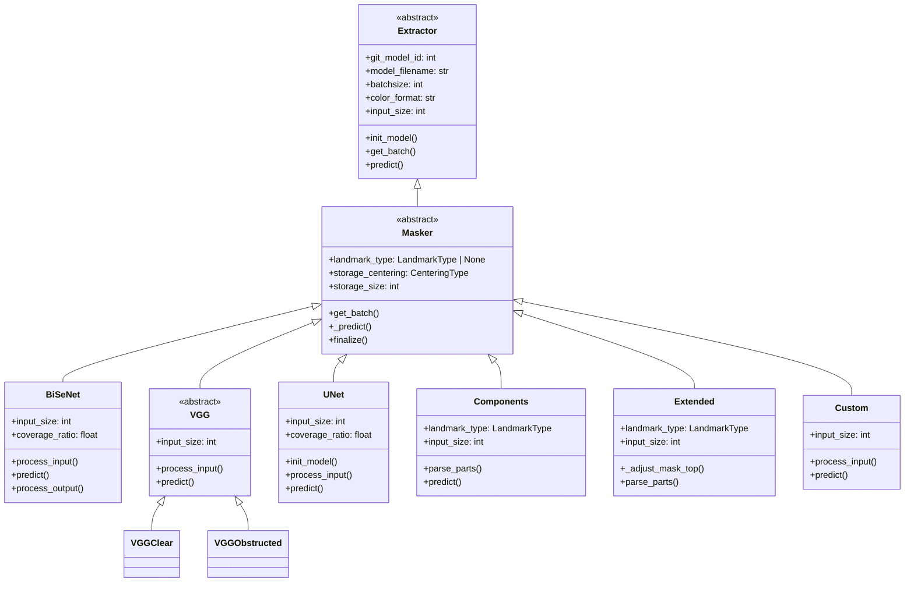
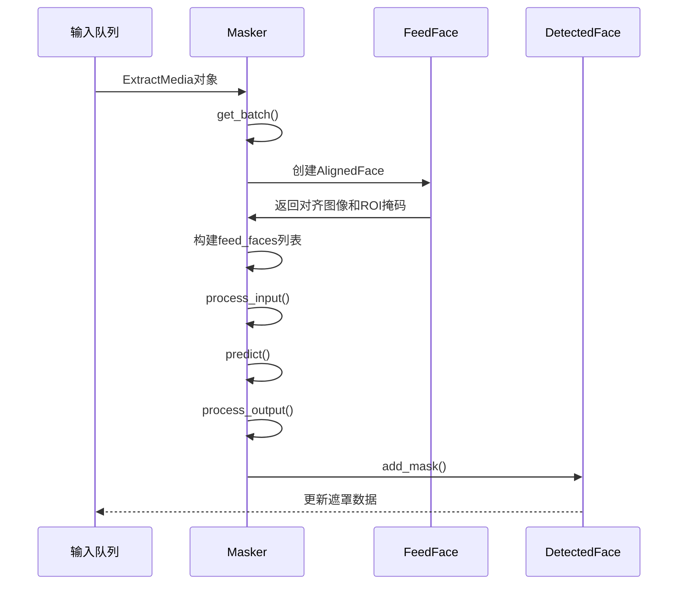
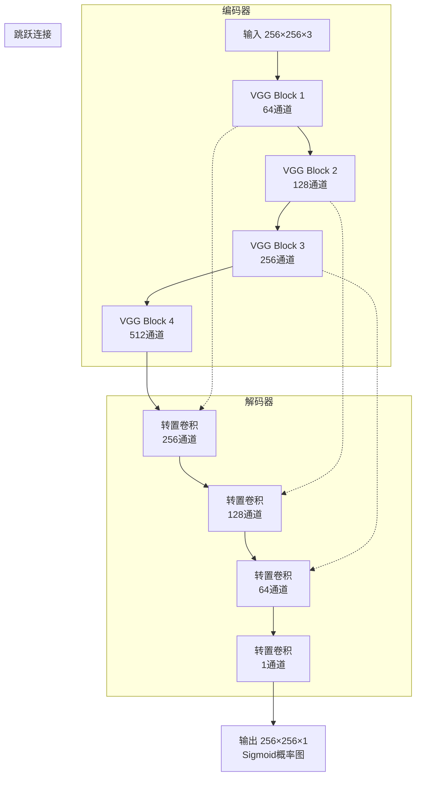
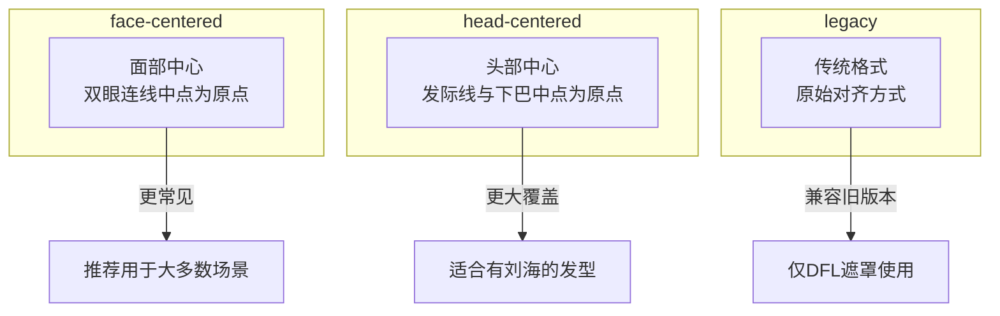
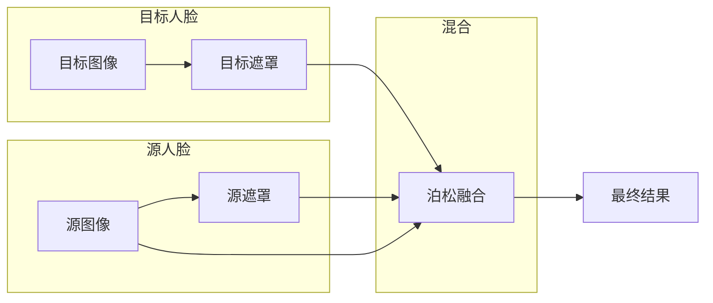

# Mask（遮罩器）产品文档

## 1. 功能概述

遮罩（Mask）是Faceswap提取流程中的第三个阶段，位于检测（Detect）和对齐（Align）之后。遮罩器的核心作用是识别并分离人脸区域与非人脸区域，生成一个二值化或概率化的掩码图像，用于指导后续的人脸交换（Swap）过程。遮罩的质量直接影响最终换脸效果的自然程度和边缘融合效果。

在Faceswap中，遮罩不仅仅是一个简单的二值分割，它包含了丰富的语义信息：
- **面部区域识别**：准确标定脸颊、额头、眼睛、鼻子、嘴巴等面部区域
- **边缘羽化处理**：在面部边缘进行平滑过渡，避免明显的接缝痕迹
- **遮挡物处理**：智能识别眼镜、头发等遮挡物，并决定是否纳入遮罩范围
- **存储格式优化**：以适合后续处理的格式存储遮罩数据

遮罩器插件采用与检测器和对齐器相同的多态设计模式，通过统一的接口封装不同的遮罩生成算法。这种设计使得Faceswap能够支持多种遮罩类型，每种类型针对不同的应用场景进行了优化。

## 2. 核心架构

### 2.1 类继承体系



遮罩器（Masker）继承自提取器基类（Extractor），这是整个提取框架的统一抽象。Extractor类定义了所有提取插件必须实现的通用接口，包括模型初始化、批处理获取、预测执行等基本流程。Masker类在此基础上增加了遮罩特定的属性和方法。

Masker类的核心设计特点包括：
- **landmark_type属性**：指定该遮罩器需要的人脸关键点类型，某些遮罩器（如Components和Extended）依赖68点人脸关键点来构建遮罩
- **storage_centering属性**：定义遮罩的存储对齐方式，可选值包括"face"（面部中心）、"head"（头部中心）和"legacy"（传统格式）
- **storage_size属性**：定义存储遮罩的尺寸，默认为128×128像素，在保证质量的同时优化存储空间
- **add_mask方法**：将生成的遮罩添加到人脸对象中，同时记录调整矩阵和插值器

### 2.2 批处理数据结构

```mermaid
flowchart LR
    subgraph 输入阶段
        A[ExtractMedia对象] --> B[get_batch方法]
        B --> C[MaskerBatch数据类]
    end
    
    subgraph 处理阶段
        C --> D[_predict方法]
        D --> E[模型推理]
        E --> F[finalize方法]
    end
    
    subgraph 输出阶段
        F --> G[生成ExtractMedia]
        G --> H[更新DetectedFace.mask]
    end
    
    subgraph MaskerBatch字段
        C -->|包含| I[detected_faces: list[DetectedFace]]
        C -->|包含| J[roi_masks: list[np.ndarray]]
        C -->|包含| K[feed_faces: list[AlignedFace]]
        C -->|包含| L[filename: list[str]]
        C -->|包含| M[prediction: np.ndarray]
    end
```

MaskerBatch是遮罩器专用的批处理数据类，它继承自ExtractorBatch并增加了遮罩处理所需的特定字段：

- **detected_faces**：人脸检测结果列表，每个DetectedFace对象将被添加一个遮罩
- **roi_masks**：兴趣区域掩码，用于在变换后的图像空间中定位人脸区域
- **feed_faces**：对齐后的人脸对象，包含变换后的图像和相应的插值器
- **prediction**：模型预测的遮罩结果，形状为(batch_size, height, width)的概率图

get_batch方法负责从上游队列接收数据并构建批处理对象。对于包含多个人脸的帧，该方法会自动拆分数据，确保每个人脸独立处理。

### 2.3 处理流程



## 3. 遮罩器插件详解

### 3.1 BiSeNet Face Parsing（双向分割网络）

BiSeNet（Bidirectional Segmentation Network）是一种高效的人脸解析神经网络，专门用于生成分类语义遮罩。该模型基于PyTorch实现，由zllrunning开发，后被移植到Keras/TensorFlow平台。

```python
class Mask(Masker):
    """ BiSeNet Face Parsing mask plugin """
    def __init__(self, **kwargs) -> None:
        self._is_faceswap, version = self._check_weights_selection()
        git_model_id = 14
        model_filename = f"bisnet_face_parsing_v{version}.h5"
        super().__init__(git_model_id=git_model_id, 
                        model_filename=model_filename, 
                        **kwargs)
        
        self.input_size = 512
        self.color_format = "RGB"
        self.vram = 384
        self.vram_per_batch = 384
```

BiSeNet的核心创新在于其双路径架构：
- **上下文路径（Context Path）**：捕获全局上下文信息，使用池化金字塔（PPM）模块聚合多尺度特征
- **空间路径（Spatial Path）**：保留高分辨率的空间细节，用于精确定位边界

BiSeNet支持两种预训练权重：
- **original**：在CelebAMask-HQ数据集上训练，包含19个语义类别
- **faceswap**：在Faceswap提取数据上微调，包含5个精简类别

两种权重的语义类别对照：

| original类别索引 | faceswap类别索引 | 语义部位 |
|-----------------|-----------------|---------|
| 0 | 0 | 背景 |
| 1 | 1 | 皮肤 |
| 2,3,4,5 | - | 左右眉毛、左右眼睛 |
| 6 | 4 | 眼镜 |
| 7,8,9 | 2 | 左右耳朵、耳饰 |
| 10 | - | 鼻子 |
| 11,12,13 | - | 嘴巴、上唇、下唇 |
| 14,15 | - | 颈部 |
| 16 | - | 衣物 |
| 17 | 3 | 头发 |
| 18 | - | 帽子 |

BiSeNet的配置参数允许用户灵活控制遮罩覆盖范围：
- **include_ears**：是否包含耳朵区域
- **include_hair**：是否包含头发区域（faceswap权重）
- **include_glasses**：是否包含眼镜区域

### 3.2 VGG Clear与VGG Obstructed

VGG遮罩系列基于牛津大学视觉几何组（Visual Geometry Group）开发的FCN-8s语义分割网络，经过重新实现以适应Keras 3框架。

```python
class Mask(Masker):
    """ VGG Clear mask plugin """
    def __init__(self, **kwargs) -> None:
        git_model_id = 8
        model_filename = "Nirkin_300_softmax_v1.h5"
        super().__init__(git_model_id=git_model_id, 
                        model_filename=model_filename, 
                        **kwargs)
        
        self.name = "VGG Clear"
        self.input_size = 300
        self.vram = 1344
        self.vram_per_batch = 448
```

VGG Clear和VGG Obstructed的区别在于：
- **VGG Clear**：针对无遮挡的清晰人脸优化，假设面部区域完整可见
- **VGG Obstructed**：针对有遮挡的人脸优化，如眼镜、口罩、围巾等

两者的技术规格对比：

| 参数 | VGG Clear | VGG Obstructed |
|------|-----------|----------------|
| 输入尺寸 | 300×300 | 500×500 |
| VRAM需求 | 1344MB | 1728MB |
| 每批VRAM | 448MB | 896MB |
| 模型来源 | Nirkin 300 | Nirkin 500 |

VGG遮罩的处理流程包括：
1. 接收对齐后的人脸图像
2. 按通道计算均值并中心化
3. 通过FCN-8s网络进行语义分割
4. 输出人体语义分割概率图

### 3.3 UNet (DFL)

UNet遮罩基于TernausNet架构，这是一种带VGG11编码器的U-Net结构，最初用于卫星图像分割，后被DeepFaceLab社区用于人脸遮罩生成。

```python
class Mask(Masker):
    """ UNET DFL face mask plugin """
    def __init__(self, **kwargs) -> None:
        git_model_id = 6
        model_filename = "DFL_256_sigmoid_v1.h5"
        super().__init__(git_model_id=git_model_id, 
                        model_filename=model_filename, 
                        **kwargs)
        
        self.name = "U-Net"
        self.input_size = 256
        self.vram = 320
        self.vram_per_batch = 256
        self._storage_centering = "legacy"
```

UNet架构的特点：
- **编码器（Encoder）**：使用预训练的VGG11作为特征提取器
- **解码器（Decoder）**：对称的转置卷积上采样路径
- **跳跃连接（Skip Connections）**：保留高分辨率细节信息
- **Sigmoid激活**：输出范围为[0, 1]的概率图



### 3.4 Components（组件遮罩）

Components遮罩是一种基于人脸关键点的几何方法，不依赖神经网络模型。它使用68个人脸关键点构建多个凸包（Convex Hull）来覆盖不同的面部区域。

```python
class Mask(Masker):
    """ Apply a landmarks based components mask """
    def __init__(self, **kwargs) -> None:
        git_model_id = None
        model_filename = None
        super().__init__(git_model_id=git_model_id, 
                        model_filename=model_filename, 
                        **kwargs)
        
        self.input_size = 256
        self.name = "Components"
        self.vram = 0  # 不使用GPU
        self.batchsize = 1
        self.landmark_type = LandmarkType.LM_2D_68
```

Components遮罩将面部划分为以下区域：

| 区域 | 关键点范围 | 描述 |
|------|-----------|------|
| 右脸颊 | 17-20 + 8 | 右侧颧骨区域 |
| 左脸颊 | 24-27 + 8 | 左侧颧骨区域 |
| 鼻梁 | 19-25 + 8 | 鼻子中心区域 |
| 右眼 | 17-22 + 27-28 + 31-36 + 8 | 右眼区域 |
| 左眼 | 22-27 + 27-28 + 31-36 + 8 | 左眼区域 |
| 鼻子 | 27-31 + 31-36 | 鼻子轮廓 |
| 右颌 | 0-8 + 17-18 | 右下颌轮廓 |
| 左颌 | 8-17 + 26-27 | 左下颌轮廓 |

这种方法的优点是：
- 完全不使用GPU，适合没有独立显卡的设备
- 生成速度快，不依赖模型加载
- 依赖关键点精度，遮罩质量与对齐器直接相关

### 3.5 Extended（扩展遮罩）

Extended遮罩是Components遮罩的增强版本，在Components的基础上增加了眉毛上方和发际线区域的覆盖。

```python
class Mask(Masker):
    """ Apply a landmarks based extended mask """
    def __init__(self, **kwargs) -> None:
        git_model_id = None
        model_filename = None
        super().__init__(git_model_id=git_model_id, 
                        model_filename=model_filename, 
                        **kwargs)
        
        self.input_size = 256
        self.name = "Extended"
        self.vram = 0
        self.batchsize = 1
```

Extended遮罩的关键改进是_adjust_mask_top方法，它通过计算眼睛与面部边缘的中点，自动将眉毛关键点向上扩展：

```python
def _adjust_mask_top(cls, landmarks: np.ndarray) -> None:
    # 计算眼睛外侧与面部边缘的中点
    ml_pnt = (landmarks[36] + landmarks[0]) // 2  # 左眼外侧与左脸边缘的中点
    mr_pnt = (landmarks[16] + landmarks[45]) // 2  # 右眼外侧与右脸边缘的中点
    
    # 计算中间点
    ql_pnt = (landmarks[36] + ml_pnt) // 2
    qr_pnt = (landmarks[45] + mr_pnt) // 2
    
    # 扩展眉毛关键点
    landmarks[17:22] = top_l + ((top_l - bot_l) // 2)
    landmarks[22:27] = top_r + ((top_r - bot_r) // 2)
```

这种扩展使得Extended遮罩能够覆盖额头区域，减少换脸后"发际线不自然"的问题。

### 3.6 Custom（自定义遮罩）

Custom遮罩是一个"虚拟"遮罩，不执行任何实际的分割操作。它简单地返回全0或全1的遮罩，用于需要手动编辑遮罩的场景或测试目的。

```python
class Mask(Masker):
    """ A mask that fills the whole face area with 1s or 0s """
    def __init__(self, **kwargs) -> None:
        super().__init__(git_model_id=None, 
                        model_filename=None, 
                        **kwargs)
        
        self.input_size = 256
        self.name = "Custom"
        self.vram = 0
        self.batchsize = cfg.batch_size()
        self._storage_centering = cfg.centering()
```

Custom遮罩的配置选项：
- **centering**：选择存储时的对齐方式（face或head）
- **fill**：选择填充值（True为全1，False为全0）

## 4. 配置参数详解

### 4.1 全局配置项

所有遮罩器共享以下配置参数：

| 参数名 | 数据类型 | 默认值 | 说明 |
|--------|---------|--------|------|
| batch_size | int | 8 | 批处理大小，影响VRAM使用和处理速度 |
| cpu | bool | False | 是否使用CPU而非GPU进行推理 |

batch_size参数对性能的影响遵循边际效益递减规律：
- 较小的batch_size（如1-4）：适合显存较小的显卡
- 中等batch_size（如8-16）：大多数场景的最佳选择
- 较大的batch_size（如32-64）：可能反而降低效率

### 4.2 插件专用配置

**BiSeNet专用配置：**

| 参数名 | 数据类型 | 默认值 | 可选值 | 说明 |
|--------|---------|--------|--------|------|
| weights | str | faceswap | faceswap, original | 选择使用的预训练权重 |
| include_ears | bool | False | True/False | 是否包含耳朵区域 |
| include_hair | bool | False | True/False | 是否包含头发区域 |
| include_glasses | bool | True | True/False | 是否包含眼镜区域 |

**Custom专用配置：**

| 参数名 | 数据类型 | 默认值 | 可选值 | 说明 |
|--------|---------|--------|--------|------|
| centering | str | face | face, head | 遮罩存储的对齐方式 |
| fill | bool | False | True/False | 填充值（1或0） |

## 5. 遮罩存储与使用

### 5.1 存储格式

遮罩以numpy ndarray格式存储在DetectedFace对象中，支持多种存储尺寸和对齐方式：

```python
face.add_mask(
    mask_name,          # 遮罩名称（如"bisenet-fp-face"）
    mask,               # 遮罩numpy数组
    adjusted_matrix,    # 调整矩阵（用于坐标变换）
    interpolator,       # 插值器（用于重采样）
    storage_size=128,   # 存储尺寸
    storage_centering="face"  # 存储对齐方式
)
```

### 5.2 对齐方式

Faceswap支持三种遮罩对齐方式：



### 5.3 在换脸中的应用

遮罩在换脸过程中的作用：



遮罩引导的混合策略：
1. **边缘羽化**：遮罩边缘的渐变过渡避免硬边
2. **区域融合**：仅在遮罩区域内进行颜色传递
3. **遮挡处理**：遮罩外的区域保留目标图像原始像素

## 6. 性能优化

### 6.1 硬件配置建议

| 遮罩类型 | 最低VRAM | 推荐VRAM | 适用场景 |
|---------|---------|----------|---------|
| Components | 0 | 0 | 无GPU或极低配置 |
| Extended | 0 | 0 | 无GPU或极低配置 |
| Custom | 0 | 0 | 无GPU或测试场景 |
| BiSeNet | 2GB | 4GB | 通用场景，推荐 |
| VGG Clear | 4GB | 6GB | 清晰人脸 |
| VGG Obstructed | 6GB | 8GB | 遮挡人脸 |
| UNet | 2GB | 4GB | 正面人脸 |

### 6.2 批处理优化

批处理大小的选择需要权衡以下因素：

```python
# VRAM计算公式
total_vram = base_vram + (batch_size - 1) * vram_per_batch

# 示例：BiSeNet
total_vram = 384 + (batch_size - 1) * 384

# 不同batch_size的VRAM需求
# batch_size=1: 384 MB
# batch_size=4: 1536 MB
# batch_size=8: 2880 MB
# batch_size=16: 5760 MB
```

### 6.3 多遮罩组合

Faceswap支持为同一人脸生成多个遮罩，并在换脸时动态选择：

```python
# 遮罩存储命名规范
mask_name = f"{plugin_name}_{centering}"
# 示例：
# "bisenet-fp_face" - BiSeNet遮罩，面部中心
# "bisenet-fp_head" - BiSeNet遮罩，头部中心
# "vgg-clear" - VGG Clear遮罩
# "components" - 组件遮罩
```

## 7. 常见问题与解决方案

### 7.1 遮罩质量相关

**问题：遮罩不完整，缺失面部区域**

可能原因与解决方案：
1. 对齐质量差：检查对齐器输出的人脸关键点是否准确
2. 模型选择不当：对于遮挡人脸，使用VGG Obstructed而非VGG Clear
3. 配置参数错误：检查include_*参数是否正确设置

**问题：遮罩包含过多背景**

可能原因与解决方案：
1. 检测框过大：检查检测器的min_size参数
2. 对齐方式不匹配：尝试切换storage_centering

**问题：遮罩边缘不自然**

可能原因与解决方案：
1. 插值器选择：在add_mask时使用正确的插值器
2. 遮罩后处理：考虑对遮罩进行高斯模糊平滑

### 7.2 性能相关

**问题：VRAM溢出**

解决方案：
1. 减小batch_size
2. 使用CPU模式（仅BiSeNet支持）
3. 启用"Single Process"模式

**问题：处理速度慢**

解决方案：
1. 增大batch_size（直到VRAM限制）
2. 使用本地SSD存储
3. 关闭不必要的遮罩类型

### 7.3 模型下载相关

**问题：找不到模型文件**

Faceswap会自动下载所需的模型文件。如果下载失败：
1. 检查网络连接
2. 手动下载模型文件并放置到正确目录
3. 验证模型文件的完整性（SHA256校验）

## 8. 最佳实践

### 8.1 遮罩器选择指南

根据不同场景推荐遮罩器：

| 场景 | 推荐遮罩 | 理由 |
|------|---------|------|
| 高质量换脸 | BiSeNet + faceswap权重 | 语义分割准确，边缘清晰 |
| 遮挡人脸 | VGG Obstructed | 专门处理眼镜等遮挡 |
| 快速测试 | Components | 不需要GPU，生成速度快 |
| 批量处理 | BiSeNet | 性价比高，兼顾质量与速度 |
| 手动编辑 | Custom | 便于后续自定义处理 |

### 8.2 参数调优建议

**BiSeNet参数调优：**
```python
# 推荐配置
include_ears = True      # 包含耳朵
include_hair = False     # 不包含头发（避免背景干扰）
include_glasses = True   # 包含眼镜

# 对于有刘海的发型
include_hair = True      # 包含头发
storage_centering = "head"  # 使用头部中心对齐
```

**批处理大小调优：**
```python
# 4GB VRAM显卡
batch_size = 4

# 6GB VRAM显卡
batch_size = 8

# 8GB+ VRAM显卡
batch_size = 16
```

### 8.3 质量检查清单

在完成提取后，建议检查以下项目：

- [ ] 遮罩覆盖完整的可见面部区域
- [ ] 遮罩边缘平滑，无明显的锯齿或断裂
- [ ] 眼镜等遮挡物被正确处理
- [ ] 无背景区域被错误包含在遮罩内
- [ ] 同一视频中的遮罩风格一致

## 9. 附录

### 9.1 遮罩器对比表

| 遮罩类型 | 算法类型 | VRAM | 精度 | 速度 | 备注 |
|---------|---------|------|------|------|------|
| BiSeNet | 深度学习 | 中 | 高 | 快 | 推荐首选 |
| VGG Clear | 深度学习 | 高 | 高 | 中 | 清晰人脸 |
| VGG Obstructed | 深度学习 | 很高 | 高 | 慢 | 遮挡人脸 |
| UNet | 深度学习 | 中 | 中高 | 快 | 正面人脸 |
| Components | 几何 | 无 | 中 | 快 | 依赖关键点 |
| Extended | 几何 | 无 | 中高 | 快 | 扩展额头区域 |
| Custom | 无 | 无 | 无 | 最快 | 手动编辑 |

### 9.2 相关文件路径

| 文件 | 路径 |
|------|------|
| 遮罩器基类 | `plugins/extract/mask/_base.py` |
| BiSeNet实现 | `plugins/extract/mask/bisenet_fp.py` |
| VGG Clear实现 | `plugins/extract/mask/vgg_clear.py` |
| VGG Obstructed实现 | `plugins/extract/mask/vgg_obstructed.py` |
| UNet实现 | `plugins/extract/mask/unet_dfl.py` |
| Components实现 | `plugins/extract/mask/components.py` |
| Extended实现 | `plugins/extract/mask/extended.py` |
| Custom实现 | `plugins/extract/mask/custom.py` |
| BiSeNet配置 | `plugins/extract/mask/bisenet_fp_defaults.py` |
| UNet配置 | `plugins/extract/mask/unet_dfl_defaults.py` |
| Custom配置 | `plugins/extract/mask/custom_defaults.py` |

### 9.3 参考资料

- BiSeNet原始论文：https://arxiv.org/abs/1808.00897
- BiSeNet PyTorch实现：https://github.com/zllrunning/face-parsing.PyTorch
- VGG Face Segmentation：https://github.com/YuvalNirkin/face_segmentation
- TernausNet：https://arxiv.org/abs/1801.05746
- CelebAMask-HQ数据集：https://github.com/switchablenorms/CelebAMask-HQ
