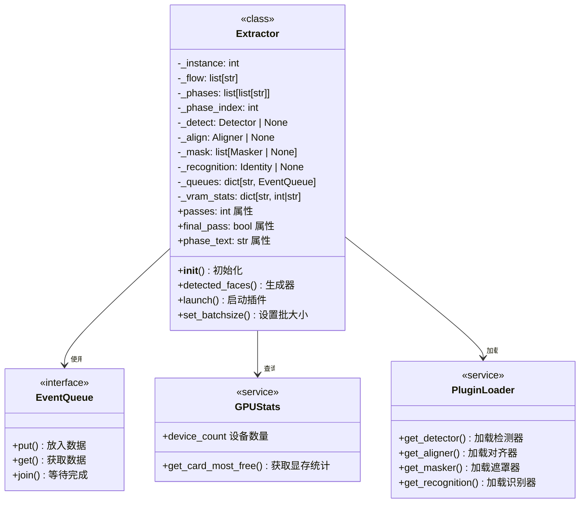
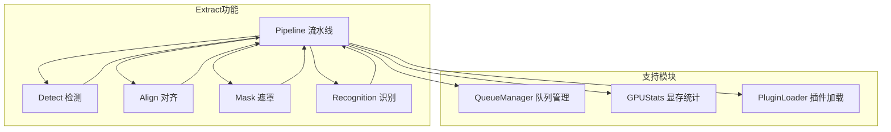
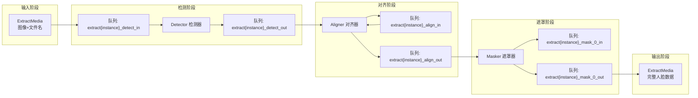
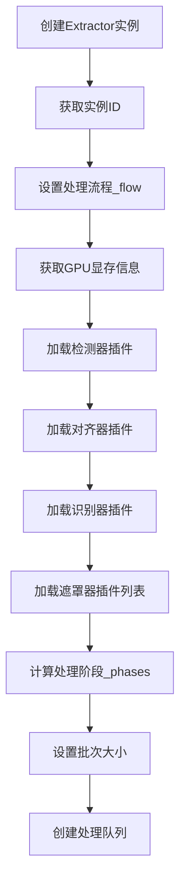
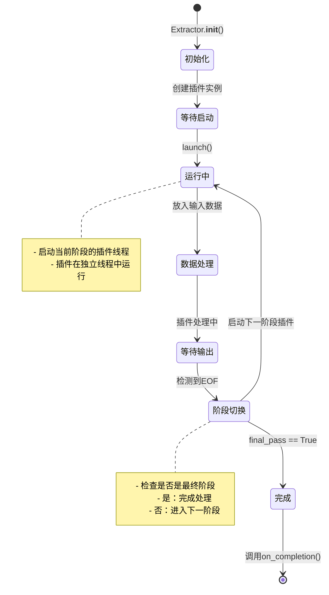
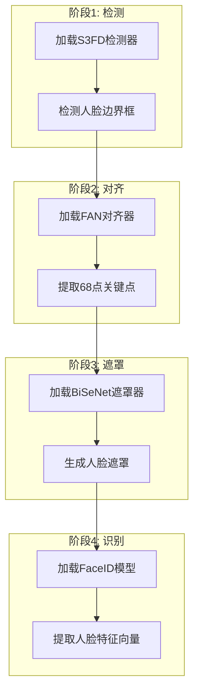

# Extract 流水线(Pipeline)产品文档

## 1. 概述

### 1.1 模块定位

流水线(Pipeline)是Extract功能的核心协调模块，位于`plugins/extract/pipeline.py`。它负责将人脸处理的三个核心步骤——检测(Detect)、对齐(Align)、遮罩(Mask)——以及可选的人脸识别(Recognition)串联成一个高效的批量处理管道。该模块采用了**多线程+队列通信**的架构模式，实现了插件的灵活组合和显存优化。

### 1.2 核心职责

Pipeline模块承担以下核心职责：
- **流程编排**：根据用户配置的插件组合，动态生成处理流程
- **显存管理**：根据GPU显存情况，自动调整批处理大小和并行策略
- **线程调度**：管理多个处理插件的并行执行
- **数据流转**：通过队列协调各阶段之间的数据传递
- **错误处理**：监控各插件的运行状态，及时捕获和处理异常

### 1.3 设计特点

Pipeline模块具有以下设计特点：
- **插件化架构**：检测、对齐、遮罩、识别插件可独立配置和加载
- **动态流程**：根据显存情况和插件组合自动调整处理阶段
- **显存感知**：自动计算显存需求，避免OOM错误
- **多实例支持**：通过实例计数器支持多个Pipeline同时运行
- **灵活的队列管理**：使用队列管理器实现插件间的解耦通信

## 2. 核心架构

### 2.1 类继承体系

Pipeline模块的架构设计相对简洁，核心是`Extractor`类，它协调所有处理插件的工作。



### 2.2 与其他模块的关系

Pipeline模块是Extract功能的枢纽，与各子模块的关系如下：



### 2.3 数据流架构

Pipeline的数据流采用**生产者-消费者**模式，各阶段通过队列解耦：



## 3. 核心功能详解

### 3.1 初始化流程

Extractor的初始化流程如下：



初始化代码的核心实现：

```python
def __init__(self, detector, aligner, masker, recognition=None,
             configfile=None, multiprocess=False, rotate_images=None,
             min_size=0, normalize_method=None, re_feed=0, re_align=False,
             disable_filter=False):
    self._instance = _get_instance()  # 获取实例ID
    self._flow = self._set_flow(detector, aligner, maskers, recognition)
    self._vram_stats = self._get_vram_stats()  # 获取显存信息
    self._detect = self._load_detect(detector, aligner, rotate_images, min_size, configfile)
    self._align = self._load_align(aligner, configfile, normalize_method, re_feed, re_align, disable_filter)
    self._recognition = self._load_recognition(recognition, configfile)
    self._mask = [self._load_mask(mask, configfile) for mask in maskers]
    self._phases = self._set_phases(multiprocess)  # 计算处理阶段
    self._phase_index = 0
    self._set_extractor_batchsize()  # 优化批次大小
    self._queues = self._add_queues()  # 创建队列
```

### 3.2 处理流程设置

`_set_flow`方法根据配置的插件生成处理流程列表：

```python
@staticmethod
def _set_flow(detector, aligner, masker, recognition) -> list[str]:
    retval = []
    if detector is not None and detector.lower() != "none":
        retval.append("detect")
    if aligner is not None and aligner.lower() != "none":
        retval.append("align")
    if recognition is not None and recognition.lower() != "none":
        retval.append("recognition")
    retval.extend([f"mask_{idx}" for idx, mask in enumerate(masker)
                   if mask is not None and mask.lower() != "none"])
    return retval
```

处理流程示例：
- 检测+对齐+遮罩：["detect", "align", "mask_0"]
- 检测+对齐+多遮罩：["detect", "align", "mask_0", "mask_1"]
- 仅检测：["detect"]

### 3.3 阶段划分策略

`_set_phases`方法根据显存情况将处理流程划分为多个阶段：

```python
def _set_phases(self, multiprocess: bool) -> list[list[str]]:
    phases = []
    current_phase = []
    available = self._vram_stats["vram_free"]

    for phase in self._flow:
        num_plugins = len([p for p in current_phase if self._vram_per_phase[p] > 0])
        num_plugins += 1 if self._vram_per_phase[phase] > 0 else 0
        scaling = self._parallel_scaling.get(num_plugins, self._scaling_fallback)
        required = sum(self._vram_per_phase[p] for p in current_phase + [phase]) * scaling

        if required <= available and multiprocess:
            current_phase.append(phase)  # 合并到当前阶段
        elif len(current_phase) == 0 or not multiprocess:
            phases.append([phase])  # 单插件阶段
        else:
            phases.append(current_phase)
            current_phase = [phase]

    if current_phase:
        phases.append(current_phase)

    return phases
```

阶段划分的考虑因素：
- **显存限制**：单阶段插件显存需求不能超过可用显存
- **并行效率**：多插件并行时的显存缩放系数
- **串行回退**：显存不足时自动切换为串行处理

### 3.4 显存缩放系数

并行处理时的显存缩放系数基于实际测试：

```python
@property
def _parallel_scaling(self) -> dict[int, float]:
    """并行插件的显存缩放系数"""
    retval = {0: 1.0,  # 无插件
              1: 1.0,  # 单插件
              2: 0.7,  # 双插件 - 70%显存需求
              3: 0.55, # 三插件 - 55%显存需求
              4: 0.5,  # 四插件 - 50%显存需求
              5: 0.4}  # 五插件 - 40%显存需求
    return retval
```

这些系数基于S3FD、FAN、UNet、VGG-Clear、VGG-Obstructed等插件的实际测试，考虑了GPU显存的非线性和优化空间。

### 3.5 批次大小优化

`_set_extractor_batchsize`方法根据可用显存动态调整批次大小：

```python
def _set_extractor_batchsize(self) -> None:
    backend = get_backend()
    if backend not in ("nvidia", "rocm"):
        return  # 仅支持GPU后端

    if sum(plugin.vram for plugin in self._active_plugins) == 0:
        return  # 无GPU插件时跳过

    batch_required = sum(plugin.vram_per_batch * plugin.batchsize
                         for plugin in self._active_plugins)

    gpu_plugins = [p for p in self._current_phase if self._vram_per_phase[p] > 0]
    scaling = self._parallel_scaling.get(len(gpu_plugins), self._scaling_fallback)
    plugins_required = sum(self._vram_per_phase[p] for p in gpu_plugins) * scaling

    vram_free = self._vram_stats["vram_free"]
    total_required = plugins_required + batch_required

    if total_required <= vram_free:
        return  # 显存充足，无需调整

    self._set_plugins_batchsize(gpu_plugins, vram_free)
```

批次优化的策略：
- 计算所有活跃插件的批次显存需求
- 如果总需求超过可用显存，优先降低高显存插件的批次大小
- 采用贪心算法选择要降级的插件

### 3.6 队列管理

Pipeline使用队列管理器进行插件间的数据传递：

```python
def _add_queues(self) -> dict[str, EventQueue]:
    queues = {}
    tasks = [f"extract{self._instance}_{phase}_in" for phase in self._flow]
    tasks.append(f"extract{self._instance}_{self._final_phase}_out")

    for task in tasks:
        queue_manager.add_queue(task, maxsize=1)  # 限制队列大小避免内存堆积
        queues[task] = queue_manager.get_queue(task)

    return queues
```

队列设计的考量：
- **单缓冲队列**：maxsize=1避免数据堆积，减少内存占用
- **命名规范**：队列名称包含实例ID和阶段信息
- **自动清理**：队列管理器统一管理队列生命周期

### 3.7 插件生命周期管理

Pipeline管理插件的完整生命周期：



### 3.8 数据输出生成器

`detected_faces`是Pipeline的核心输出接口：

```python
def detected_faces(self) -> Generator[ExtractMedia, None, None]:
    logger.debug("Running Detection. Phase: '%s'", self._current_phase)
    out_queue = self._output_queue

    while True:
        try:
            self._check_and_raise_error()
            faces = out_queue.get(True, 1)
            if faces == "EOF":
                break
        except QueueEmpty:
            continue
        yield faces

    self._join_threads()
    if self.final_pass:
        for plugin in self._all_plugins:
            plugin.on_completion()
        logger.debug("Detection Complete")
    else:
        self._phase_index += 1
```

## 4. 配置参数详解

### 4.1 构造函数参数

| 参数名 | 类型 | 默认值 | 说明 |
|--------|------|--------|------|
| detector | str \| None | 必填 | 检测器插件名称 |
| aligner | str \| None | 必填 | 对齐器插件名称 |
| masker | str \| list \| None | 必填 | 遮罩器插件名称 |
| recognition | str \| None | None | 人脸识别插件名称 |
| configfile | str \| None | None | 自定义配置文件路径 |
| multiprocess | bool | False | 是否启用并行处理 |
| rotate_images | str \| None | None | 图像旋转角度配置 |
| min_size | int | 0 | 最小人脸尺寸过滤 |
| normalize_method | str \| None | None | 对齐图像归一化方法 |
| re_feed | int | 0 | 重新送入次数 |
| re_align | bool | False | 是否重新对齐 |
| disable_filter | bool | False | 禁用对齐过滤器 |

### 4.2 关键属性

| 属性名 | 类型 | 只读 | 说明 |
|--------|------|------|------|
| passes | int | 是 | 总处理阶段数 |
| phase_text | str | 是 | 当前阶段插件名称描述 |
| final_pass | bool | 是否为最终阶段 |
| input_queue | EventQueue | 是 | 当前阶段输入队列 |
| aligner | Aligner | 是 | 当前对齐器实例 |
| recognition | Identity | 是 | 当前识别器实例 |

### 4.3 VRAM统计信息

通过`_vram_stats`属性获取GPU显存信息：

```python
{
    "count": GPU设备数量,
    "device": 当前设备名称,
    "vram_free": 可用显存MB,
    "vram_total": 总显存MB
}
```

## 5. 使用示例

### 5.1 基础使用模式

```python
from plugins.extract.pipeline import Extractor

# 创建流水线实例
extractor = Extractor(
    detector="s3fd",
    aligner="fan",
    masker="bisenet_fp",
    recognition="faceidres",
    multiprocess=True
)

# 启动流水线
extractor.launch()

# 处理数据
for phase in extractor.passes:
    for filename in file_list:
        image = load_image(filename)
        extract_media = ExtractMedia(filename, image)
        extractor.input_queue.put(extract_media)

# 获取结果
for extract_media in extractor.detected_faces():
    process_result(extract_media)
```

### 5.2 多阶段处理流程



### 5.3 显存不足时的自动降级

当GPU显存不足时，Pipeline会自动进行以下调整：

1. **并行→串行切换**：关闭多插件并行处理
2. **批次大小缩减**：降低各插件的batchsize
3. **阶段拆分**：将多个插件拆分到不同阶段执行

```python
# 显存充足时
phases = [["detect", "align", "mask_0"]]  # 单阶段并行

# 显存不足时
phases = [["detect"], ["align"], ["mask_0"]]  # 三阶段串行
```

## 6. 高级特性

### 6.1 多实例支持

Pipeline通过`_instance`计数器支持多个实例同时运行：

```python
_INSTANCES = -1

def _get_instance():
    global _INSTANCES
    _INSTANCES += 1
    return _INSTANCES
```

这使得Pipeline可以处理多个独立的提取任务而互不干扰。

### 6.2 外部数据导入

当使用External插件时，Pipeline支持从JSON文件导入检测和对齐数据：

```python
def import_data(self, input_location: str) -> None:
    import_plugins = [p for p in (self._detect, self.aligner)
                      if p.name.lower() == "external"]

    if not import_plugins:
        return

    # 从JSON文件加载数据
    data = get_serializer("json").load(path)

    # 导入到对应插件
    for plugin in import_plugins:
        plugin.import_data(data)
```

### 6.3 人脸识别集成

人脸识别模块可选集成，用于提取人脸特征向量：

```python
# 识别结果存储在ExtractMedia中
for extract_media in extractor.detected_faces():
    for face in extract_media.detected_faces:
        if hasattr(face, 'identity'):
            print(f"人脸ID: {face.identity}")
```

### 6.4 错误处理与线程管理

Pipeline提供完善的错误处理机制：

```python
def _check_and_raise_error(self) -> None:
    """检查所有线程的错误状态"""
    for plugin in self._active_plugins:
        plugin.check_and_raise_error()

def _join_threads(self):
    """等待当前阶段所有线程完成"""
    for plugin in self._active_plugins:
        plugin.join()
```

## 7. 性能优化建议

### 7.1 显存优化策略

| 策略 | 效果 | 适用场景 |
|------|------|----------|
| 启用并行处理 | 提高GPU利用率 | 显存充足时 |
| 使用轻量级遮罩 | 减少显存占用 | 显存受限 |
| 降低batchsize | 减少峰值显存 | OOM错误时 |
| 禁用识别模块 | 节省显存 | 不需要身份识别时 |

### 7.2 批处理配置建议

| 场景 | 推荐batchsize | 说明 |
|------|---------------|------|
| RTX 3090+ (24GB) | 16-32 | 可使用较大批次 |
| RTX 2080 (8GB) | 8-16 | 适中批次 |
| GTX 1080 (8GB) | 4-8 | 较小批次 |
| 显存不足 | 自动调节 | 启用自动优化 |

### 7.3 多遮罩组合策略

使用多个遮罩时的显存考虑：

```python
# 推荐组合
masker_list = ["bisenet_fp", "vgg_clear"]  # 基础+精细遮罩

# 显存消耗
# BiSeNet: ~300MB
# VGG-Clear: ~400MB
# 组合使用: 约700MB (考虑缩放系数)
```

## 8. 常见问题

### Q1: Pipeline显示"Not enough free VRAM"怎么办？

这是因为当前GPU显存不足以并行运行所有插件。解决方案：
1. 使用`multiprocess=False`强制串行处理
2. 减少同时使用的遮罩数量
3. 降低batchsize配置
4. 关闭不必要的后台程序

### Q2: 如何查看当前处理阶段？

```python
for phase_idx in range(extractor.passes):
    print(f"当前阶段: {extractor.phase_text}")
    print(f"进度: {phase_idx + 1}/{extractor.passes}")
```

### Q3: 如何手动设置batchsize？

```python
# 在launch()之前设置
extractor.set_batchsize("detect", 8)
extractor.set_batchsize("align", 4)
extractor.launch()
```

### Q4: 外部数据导入有什么限制？

使用External插件导入数据时：
- 必须提供JSON格式的文件
- 数据必须包含人脸边界框和关键点
- 关键点必须是68点2D格式才能使用landmark遮罩
- 导入数据后会自动禁用不兼容的遮罩器

## 9. 内部方法详解

### 9.1 私有属性列表

| 属性名 | 类型 | 说明 |
|--------|------|------|
| _instance | int | 实例ID |
| _flow | list[str] | 处理流程列表 |
| _phases | list[list[str]] | 阶段划分 |
| _phase_index | int | 当前阶段索引 |
| _detect | Detector \| None | 检测器实例 |
| _align | Aligner \| None | 对齐器实例 |
| _mask | list[Masker \| None] | 遮罩器列表 |
| _recognition | Identity \| None | 识别器实例 |
| _queues | dict[str, EventQueue] | 队列字典 |
| _vram_stats | dict[str, int\|str] | 显存统计 |

### 9.2 核心内部方法

| 方法名 | 功能 |
|--------|------|
| _set_flow() | 设置处理流程 |
| _set_phases() | 划分处理阶段 |
| _set_extractor_batchsize() | 优化批次大小 |
| _add_queues() | 创建处理队列 |
| _load_detect() | 加载检测器 |
| _load_align() | 加载对齐器 |
| _load_mask() | 加载遮罩器 |
| _load_recognition() | 加载识别器 |
| _launch_plugin() | 启动插件 |
| _check_and_raise_error() | 错误检查 |
| _join_threads() | 线程同步 |

## 10. 版本兼容性

### 10.1 依赖版本

| 依赖 | 最低版本 | 说明 |
|------|----------|------|
| Python | 3.8 | 类型注解支持 |
| lib.queue_manager | - | 队列管理模块 |
| lib.gpu_stats | - | GPU统计模块 |
| lib.serializer | - | 序列化模块 |

### 10.2 已知限制

- 仅支持NVIDIA和ROCM GPU后端
- 不支持CPU-only模式下的并行处理
- External插件需要特定格式的JSON数据
- 部分遮罩器需要68点2D关键点
