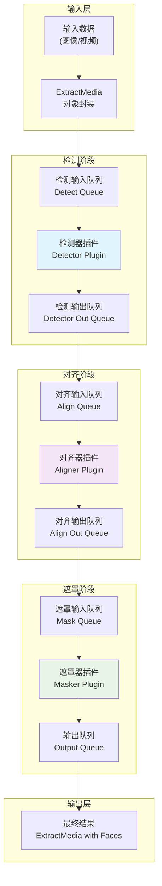
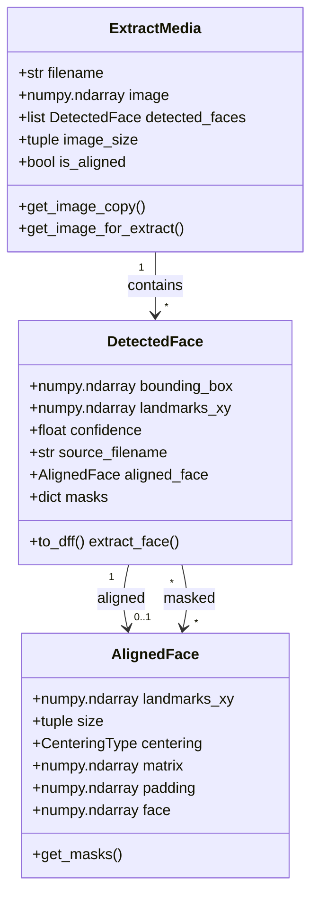

# Faceswap Extract 功能产品文档

## 文档概述

本文档详细描述了 Faceswap 项目中人脸提取（Extract）功能的完整产品设计和技术实现。Extract 模块是 Faceswap 工作流程的核心环节，负责从原始图像或视频中检测、对齐并提取人脸区域，为后续的模型训练和人脸交换提供标准化的输入数据。

Faceswap 的人脸提取功能采用了高度模块化的插件架构设计，将整个提取过程分解为三个独立的处理阶段：人脸检测（Detect）、人脸对齐（Align）和人脸遮罩（Mask）。这种分层设计使得各功能模块可以独立开发和优化，同时也为用户提供了极大的灵活性，可以根据不同的使用场景选择最合适的算法组合。

整个提取流程采用多线程流水线架构，充分利用现代多核处理器的并行计算能力。检测、对齐和遮罩三个阶段分别在独立的线程中运行，通过队列进行数据传递，实现了高效的批处理机制。这种设计不仅提高了处理速度，还能有效利用 GPU 的并行计算能力，在保持高质量输出的同时最大化系统资源利用率。

## 目录结构

本产品文档按照功能模块进行组织，共分为以下子文档：

**核心功能模块文档：**

- [Detect（检测器）](Detect.md)：详细描述了人脸检测功能的产品设计，包括检测算法选择、旋转处理、最小人脸尺寸过滤等核心功能点，以及各检测插件的技术规格和适用场景分析。

- [Align（对齐器）](Align.md)：完整介绍了人脸对齐功能的设计理念和技术实现，涵盖关键点检测、人脸变换对齐、参考缩放等关键处理步骤，以及各对齐插件的能力对比和配置说明。

- [Mask（遮罩器）](Mask.md)：全面阐述了人脸遮罩生成功能的产品设计，包括遮罩类型划分、区域分割、存储格式等核心技术细节，以及不同遮罩算法的效果对比和选择建议。

- [Pipeline（流水线）](Pipeline.md)：深入解析了提取流程的整体架构设计，包括多阶段处理流程、队列管理机制、批处理策略、错误处理和恢复机制等关键技术实现。

- [Config（配置）](Config.md)：系统整理了所有可配置的参数项，按功能分类详细说明每个配置项的作用、取值范围、默认值以及对提取效果的影响。

## 技术架构概览

Faceswap 的 Extract 模块采用了经典的生产者-消费者模式进行架构设计。整个系统由输入队列、处理线程和输出队列三部分组成，形成一条高效的数据处理流水线。输入数据首先被放入检测阶段的输入队列，检测器线程从队列中取出数据进行人脸检测，检测结果通过内部队列传递给对齐器线程，对齐后的结果继续传递给遮罩器线程，最终的完整提取结果从输出队列输出。

这种流水线架构的优势在于各个阶段可以并行执行。当检测器处理第 N 帧时，对齐器可以同时处理第 N-1帧的检测结果，遮罩器则处理第 N-2帧的对齐结果。这种重叠执行的方式大大提高了整体吞吐量，特别是在使用 GPU 加速时，能够保持 GPU 核心持续满载运行，避免因等待数据传输造成的性能损失。

每个处理阶段都支持多种算法插件的动态加载，这种设计遵循了开闭原则，使得系统可以轻松扩展新的算法而无需修改现有代码。所有插件都继承自统一的基类 `Extractor`，基类定义了标准化的接口规范，包括 `init_model()`、`process_input()`、`predict()` 和 `process_output()` 四个核心方法，不同类型的插件通过重写这些方法实现各自的特定功能。

## 核心数据流设计

在数据流转方面，Extract 模块定义了标准化的数据结构来描述处理过程中的各类数据。`ExtractMedia` 类是封装输入输出的核心数据结构，它包含了原始图像、检测到的人脸列表、处理状态等信息。人脸检测结果被封装为 `DetectedFace` 对象，其中记录了人脸边界框、置信度、关键点坐标等完整信息。对齐后的结果通过 `AlignedFace` 对象存储，包含标准化的关键点坐标、变换矩阵、对齐后的人脸图像等数据。

批处理机制是提高处理效率的关键技术。系统将连续的多个输入项组成批次（Batch），每个批次包含固定数量的数据项，批次大小可以通过配置参数进行调整。较大的批次可以更好地利用 GPU 的并行计算能力，但也会占用更多显存；较小的批次则更节省显存，但可能无法充分发挥 GPU 性能。系统采用了动态批次大小的策略，在处理过程中根据实际可用显存自动调整批次大小，以在性能和稳定性之间取得平衡。

## 使用场景分析

Faceswap 的 Extract 功能适用于多种实际应用场景。在人脸替换（Face Swap）工作流程中，Extract 是第一个关键步骤，需要从源素材中高质量地提取人脸，为后续的模型训练和融合处理提供数据基础。在模型训练阶段，高质量的人脸提取直接影响训练效果，因此需要根据源素材的特点选择合适的检测和对齐算法。

对于高质量素材（如蓝光电影、专业摄影），建议使用检测精度最高的 S3FD 检测器配合 FAN 对齐器，能够准确捕捉细微的人脸特征。对于低质量素材（如老照片、监控录像），则需要使用对图像质量不那么敏感的 MTCNN 检测器，并在配置中调整相应的过滤参数。

在批量处理场景中，处理效率是首要考虑因素。可以通过增加批次大小、启用多进程模式、选择计算效率更高的算法组合来提升吞吐量。同时，系统支持断点续传功能，在处理中断后可以从中断点继续处理，避免重复劳动。

## 插件系统详解

Faceswap 的插件系统采用了策略模式的设计思想，将不同的人脸处理算法封装为独立的插件单元。插件之间遵循统一的接口规范，可以自由组合使用。每个插件都有唯一的名称标识，通过插件加载器（PluginLoader）进行管理和实例化。

插件的配置文件采用分层的组织结构，系统默认配置位于 `config/extract.ini` 文件中，用户自定义配置可以覆盖默认配置。每个插件还可以定义自己的默认配置（`*_defaults.py` 文件），这些配置在插件加载时自动应用。这种分层配置机制既保证了系统的稳定性，又为用户提供了灵活的定制能力。

插件的版本管理通过 Git 模型标识符（git_model_id）实现。每个插件在发布时会分配一个版本标识符，该标识符包含在模型文件名中。系统在加载插件时会检查本地模型文件版本与最新版本的差异，如果存在新版本，会提示用户更新模型文件。这种机制确保了用户始终使用最新最优的算法实现。

## 性能优化策略

在性能优化方面，Faceswap 采用了多层次的优化策略。CPU 层面的优化包括使用 NumPy 的向量化操作替代 Python 循环、使用 OpenCV 的并行处理能力、启用多线程批处理等。GPU 层面的优化则包括混合精度计算、显存动态分配、模型推理优化等。

内存管理是另一个重要的优化点。系统采用延迟加载策略，仅在需要时才将数据加载到内存；使用内存池机制复用已分配的内存空间；定期清理不再使用的大对象，避免内存泄漏。对于 GPU 显存，系统实现了智能的显存管理机制，能够在处理过程中动态调整显存占用，避免因显存不足导致的处理失败。

批量大小（batchsize）的选择对性能有显著影响。系统提供了自动调节机制，根据检测到的 GPU 显存大小自动计算最优的批次大小。同时，用户也可以手动指定批次大小，以适应特定的硬件环境或处理需求。在命令行界面中，可以通过 `-b` 参数指定批次大小；在图形界面中，可以在设置菜单中调整相关参数。

## 扩展开发指南

对于希望扩展 Faceswap Extract 功能的开发者，系统提供了清晰的扩展接口。开发新的检测器插件需要继承 `Detector` 基类并实现四个核心方法：`init_model()` 用于初始化模型；`process_input()` 用于预处理输入数据；`predict()` 用于执行模型推理；`process_output()` 用于后处理检测结果。

对齐器和遮罩器的开发遵循相似的模式，分别继承 `Aligner` 和 `Masker` 基类。开发者在实现核心算法的同时，还需要关注内存效率、错误处理、日志记录等方面的实现，确保插件的稳定性和可维护性。插件开发完成后，需要编写对应的默认配置文件（`*_defaults.py`），定义插件专属的配置项和默认值。

系统还提供了插件测试框架，开发者可以基于已有的测试用例编写新插件的测试代码，确保插件的正确性和性能。测试框架支持单元测试、集成测试和性能测试三个层次，能够全面验证插件的各项指标。
